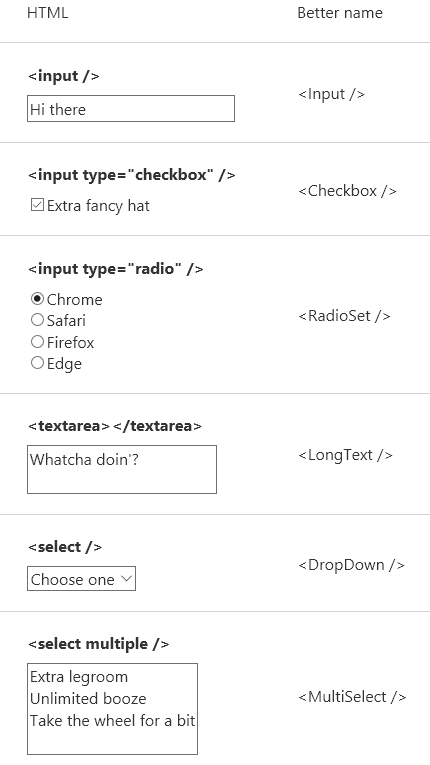

# React 编程思想

*我们总是寻找最佳实战,不断的解决学习React的各种疑惑 。*

## Dva的React/JSX 编码规范

### 内容目录

* [JavaScript 语言](#javascript-语言)
  1. [复杂的表达式](#复杂的表达式)
	1. [否定条件表达式](#否定条件表达式)
	1. [const 和 let](#const-和-let)
	1. [模板字符串](#模板字符串)
  1. [默认参数](#默认参数)
  1. [箭头函数](#箭头函数)
  1. [模块的 Import 和 Export](#模块的-import-和-export)
  1. [析构赋值](#析构赋值)
  1. [对象字面量扩展语法](#对象字面量扩展语法)
  1. [Spread Operator](#spread-operator)
  1. [Promises](#promises)
  1. [Generators](#generators)
* [React Component](#react-component)
	1. [General rules](#general-rules)
  1. [Stateless Functional Components](#stateless-functional-components)
  1. [Component 嵌套](#component-嵌套)
  1. [className](#classname)
  1. [JavaScript 表达式](#javascript-表达式)
  1. [Mapping Arrays to JSX](#mapping-arrays-to-jsx)
  1. [注释](#注释)
  1. [Spread Attributes](#spread-attributes)
  1. [propTypes](#proptypes)
  1. [往下传数据](#往下传数据)
  1. [往上传数据](#往上传数据)
	1. [表单元素](#表单元素)
  1. [理解 CSS Modules](#理解-css-modules)
  1. [定义全局 CSS](#定义全局-css)
  1. [classnames Package](#classnames-package)
  1. [path-to-regexp Package](#path-to-regexp-package)
* [Router](#router)
  1. [Config with JSX Element (router.js)](#config-with-jsx-element-routerjs)
  1. [Route Components](#route-components)
  1. [通过 connect 绑定数据](#通过-connect-绑定数据)
  1. [Injected Props (e.g. location)](#injected-props-eg-location)
  1. [基于 action 进行页面跳转](#基于-action-进行页面跳转)
* [工具](#工具)
  1. [通过 bees-cli 创建项目](#通过-bees-cli-创建项目)

### JavaScript 语言

#### 复杂的表达式
```javascript
// good
var shouldContinue = !options || (options.continue && options.hasWon);
if (shouldContinue) {

}

// bad
if (!options || (options.continue && options.hasWon)) {

}
```
**[⬆ back to top](#内容目录)**

#### 否定条件表达式
```javascript
// good
if (something && somethingElse) {
    /* do stuff*/
} else {
    /* do other stuff */
}

// bad (negative case comes first)

if (!something || !somethingElse ) {
    /* do stuff */
} else {
    /* do other stuff */
}
```
**[⬆ back to top](#内容目录)**

#### const 和 let

不要用 `var`，而是用 `const` 和 `let`，分别表示常量和变量。不同于 `var` 的函数作用域，`const` 和 `let` 都是块级作用域, `let` 一般只有值容器明确地被确定将会被改变时才使用它定义变量。

```javascript
const PI = 1.1415926;

let count = 0;
count = count + 1;

const foo = {
  a: 1,
  b: 2
}

// for 循环语句
const arr = [];
for(let i = 1; i < 5; i++){
  arr.push(() => i);
}
```
**[⬆ back to top](#内容目录)**
#### 模板字符串

模板字符串提供了另一种做字符串组合的方法。

```javascript
const user = 'world';
console.log(`hello ${user}`);  // hello world

// 多行
const content = `
  Hello ${firstName},
  Thanks for ordering ${qty} tickets to ${event}.
`;
```

#### 默认参数

```javascript
function logActivity(activity = 'skiing') {
  console.log(activity);
}

logActivity();  // skiing
```

#### 箭头函数

函数的快捷写法，不需要通过 `function` 关键字创建函数，并且还可以省略 `return` 关键字。

同时，箭头函数还会继承当前上下文的 `this` 关键字。

比如：

```javascript
[1, 2, 3].map(x => x + 1);  // [2, 3, 4]
```

等同于：

```javascript
[1, 2, 3].map((function(x) {
  return x + 1;
}).bind(this));
```

#### 模块的 Import 和 Export

`import` 用于引入模块，`export` 用于导出模块。

比如：

```javascript
// 引入全部
import React from 'react';

// 引入部分
import React, {Component} from 'react';
import { render, unmountComponentAtNode } from 'react-dom';

// 引入全部并作为 github 对象
import * as github from './services/github';

// 导出默认
export default App;
// 部分导出，需 import { App } from './file'; 引入
export class App extend Component {};
```


#### 析构赋值

析构赋值让我们从 Object 或 Array 里取部分数据存为变量。

```javascript
// 对象
const user = { name: 'guanguan', age: 2 };
const { name, age } = user;
console.log(`${name} : ${age}`);  // guanguan : 2

// 数组
const arr = [1, 2];
const [foo, bar] = arr;
console.log(foo);  // 1
```

我们也可以析构传入的函数参数。

```javascript
const add = (state, { payload }) => {
  return state.concat(payload);
};
```

析构时还可以配 alias，让代码更具有语义。

```javascript
const add = (state, { payload: todo }) => {
  return state.concat(todo);
};
```

#### 对象字面量扩展语法

这是析构的反向操作，用于重新组织一个 Object 。

```javascript
const name = 'duoduo';
const age = 8;

const user = { name, age };  // { name: 'duoduo', age: 8 }
```

定义对象方法时，还可以省去 `function` 关键字。

```javascript
const obj = {
  foo() {} // 等同于 foo: function() {}
  *bar() {} // 等同于 bar: function*() {}
};

// 将属性名定义省略
const foo = 123
const bar = () => foo
const obj = {
  foo, // 等同于 foo: 123
  bar // 等同于 foo: () => {}
}
```

#### Spread Operator

Spread Operator 即 3 个点 `...`，有几种不同的使用方法。

可用于组装数组。

```javascript
const todos = ['Learn dva'];
[...todos, 'Learn antd'];  // ['Learn dva', 'Learn antd']
```

也可用于获取数组的部分项。

```javascript
const arr = ['a', 'b', 'c'];
const [first, ...rest] = arr;
rest;  // ['b', 'c']

// With ignore
const [first, , ...rest] = arr;
rest;  // ['c']
```

还可收集函数参数为数组。

```javascript
function directions(first, ...rest) {
  console.log(rest);
}
directions('a', 'b', 'c');  // ['b', 'c'];
```

代替 apply。

```javascript
function foo(x, y, z) {}
const args = [1,2,3];

// 下面两句效果相同
foo.apply(null, args);
foo(...args);
```

对于 Object 而言，用于组合成新的 Object 。(ES2017 stage-2 proposal)

```javascript
const foo = {
  a: 1,
  b: 2,
};
const bar = {
  b: 3,
  c: 2,
};
const d = 4;

const ret = { ...foo, ...bar, d };  // { a:1, b:3, c:2, d:4 }
```

此外，在 JSX 中 Spread Operator 还可用于扩展 props，详见 [Spread Attributes](#spread-attributes)。

#### Promises

Promise 用于更优雅地处理异步请求。比如发起异步请求：

```javascript
fetch('/api/todos')
  .then(res => res.json())
  .then(data => ({ data }))
  .catch(err => ({ err }));
```

定义 Promise 。

```javascript
const delay = (timeout) => {
  return new Promise(resolve => {
    setTimeout(resolve, timeout);
  });
};

delay(1000).then(_ => {
  console.log('executed');
});
```
完整的 Promise 使用
```
import axios from 'axios';
export default function (url, json, method = 'post', timeout = 25000) {
  const promise = new Promise((resolve, reject) => {
    if (!url || !json) {
      reject({ status: 0, msg: 'url or josn is null' });
    }
    const req = {
      url,
      method,
      data: json,
      timeout,
      headers: { Accept: 'application/json', 'Content-Type': 'application/json' },
    };
    axios(req)
      .then((response) => {
        const res = response.data;
        if (res.success) {
          resolve(res.data);
        } else if (res.msg === 'Request failed with status code 401') {
          reject(res.msg);
        } else {
          reject(res.msg);
        }
      })
      .catch((error) => {
        console.error(`Ajax error: ${url} ### ${error}`);
        if (error.message) {
          reject(error.message);
        } else {
          reject(`Ajax 异常: ${url}`);
        }
      });
  });
  return promise;
}
```

Promise.all() 方法用于将多个Promise实例，包装成一个新的Promise实例。
```
// 生成一个Promise对象的数组
var promises = [2, 3, 5, 7, 11, 13].map(function (id) {
  return getJSON("/post/" + id + ".json");
});

Promise.all(promises).then(function (posts) {
  // ...
}).catch(function(reason){
  // ...
});
// 上面代码中，promises是包含6个Promise实例的数组，只有这6个实例的状态都变成fulfilled，或者其中有一个变为rejected，才会调用Promise.all方法后面的回调函数。
```
#### Generators

Generator 返回的是迭代器，通过 `yield` 关键字实现暂停功能。

```javascript
function* foo() {
  yield 1
  yield 1
}

function* bar() {
  yield* foo()
  yield 3
  yield 4
}
```

### React Component
#### General rules
```javascript
// good
render() {
  return (
    <Component value="foo">
      <ChildComponent />
    </Component>
  );
}

// bad (why torture yourself with React.createElement?)
render() {
  return React.createElement(
    Component,
    { value: "foo" },
    React.createElement(ChildComponent, null)
  );
}
```

####  Stateless Functional Components

React Component 有 3 种定义方式，分别是 `React.createClass`, `class` 和 `Stateless Functional Component`。推荐尽量使用最后一种，保持简洁和无状态。这是函数，不是 Object，没有 `this` 作用域，是 pure function。

比如定义 App Component 。

```javascript
function App(props) {
  function handleClick() {
    props.dispatch({ type: 'app/create' });
  }
  return <div onClick={handleClick}>${props.name}</div>
}
```

等同于：

```javascript
class App extends React.Componnet {
  handleClick() {
    this.props.dispatch({ type: 'app/create' });
  }
  render() {
    return <div onClick={this.handleClick.bind(this)}>${this.props.name}</div>
  }
}
```

进一步优化
```javascript
// good
class App extends React.Component {
  constructor(props) {
    super(props);

    this.handleClick = this.handleClick.bind(this);
  }

  handleClick() {
    // do stuff
  }

  render() {
    return <div onClick={this.handleClick} />
  }
}

// good
class App extends React.Component {
  handleClick = (event) => {
    // do stuff
  }

  render() {
    return <div onClick={this.handleClick} />
  }
}
```

### JSX

#### Component 嵌套

类似 HTML，JSX 里可以给组件添加子组件。

```html
<App>
  <Header />
  <MainContent />
  <Footer />
</App>
```

#### className

`class` 是保留词，所以添加样式时，需用 `className` 代替 `class` 。

```html
<h1 className="fancy">Hello dva</h1>
```

#### JavaScript 表达式

JavaScript 表达式需要用 `{}` 括起来，会执行并返回结果。

比如：

```javascript
<h1>{ this.props.title }</h1>
```

#### Mapping Arrays to JSX

可以把数组映射为 JSX 元素列表。

```javascript
<ul>
  { this.props.todos.map((todo, i) => <li key={i}>{todo}</li>) }
</ul>
```

#### 注释

尽量别用 `//` 做单行注释。

```javascript
<h1>
  {/* multiline comment */}
  {/*
    multi
    line
    comment
    */}
  {
    // single line
  }
  Hello
</h1>
```

#### Spread Attributes

这是 JSX 从 ECMAScript6 借鉴过来的很有用的特性，用于扩充组件 props 。

比如：

```javascript
const attrs = {
  href: 'http://example.org',
  target: '_blank',
};
<a {...attrs}>Hello</a>
```

等同于

```javascript
const attrs = {
  href: 'http://example.org',
  target: '_blank',
};
<a href={attrs.href} target={attrs.target}>Hello</a>
```

#### Props

数据处理在 React 中是非常重要的概念之一，分别可以通过 props, state 和 context 来处理数据。而在 dva 应用里，你只需关心 props 。

#### propTypes

JavaScript 是弱类型语言，所以请尽量声明 propTypes 对 props 进行校验，以减少不必要的问题。

```javascript
function App(props) {
  return <div>{props.name}</div>;
}
App.propTypes = {
  name: React.PropTypes.string.isRequired,
};
```

内置的 prop type 有：

- PropTypes.array
- PropTypes.bool
- PropTypes.func
- PropTypes.number
- PropTypes.object
- PropTypes.string

#### 往下传数据


#### 往上传数据


#### 表单元素
输入应该通过onChange方法返回一个值，而不是一个JavaScript事件实例。
你可以进一步确保在onChange返回的数据类型和传递的数据类型相匹配。



```javascript
class Input extends Component {
  componentDidMount() {
    // this.el.focus();
    this.focus();
  }
  focus() {
    this.el.focus();
  }
  
  render() {
    return (
      <input
        ref={el=> { this.el = el; }}
      />
    );
  }
}

class Input extends Component {
  handleNameChange = (e) => {
    this.props.username = e.target.value
  }
  render() {
    return (
      <input
        type="text"
        onChange={this.handleNameChange}
        placeholder="Your Name"/>
    );
  }
}

```

#### 理解 CSS Modules

一张图理解 CSS Modules 的工作原理：


`button` class 在构建之后会被重命名为 `ProductList_button_1FU0u` 。`button` 是 local name，而 `ProductList_button_1FU0u` 是 global name 。**你可以用简短的描述性名字，而不需要关心命名冲突问题。**

然后你要做的全部事情就是在 css/less 文件里写 `.button {...}`，并在组件里通过 `styles.button` 来引用他。

#### 定义全局 CSS

CSS Modules 默认是局部作用域的，想要声明一个全局规则，可用 `:global` 语法。

比如：

```css
.title {
  color: red;
}
:global(.title) {
  color: green;
}
```

然后在引用的时候：

```javascript
<App className={styles.title} /> // red
<App className="title" />        // green
```

#### `classnames` Package

在一些复杂的场景中，一个元素可能对应多个 className，而每个 className 又基于一些条件来决定是否出现。这时，[classnames](https://github.com/JedWatson/classnames) 这个库就非常有用。

```javascript
import classnames from 'classnames';
const App = (props) => {
  const cls = classnames({
    btn: true,
    btnLarge: props.type === 'submit',
    btnSmall: props.type === 'edit',
  });
  return <div className={ cls } />;
}
```

这样，传入不同的 type 给 App 组件，就会返回不同的 className 组合：

```javascript
<App type="submit" /> // btn btnLarge
<App type="edit" />   // btn btnSmall
```

#### 异步请求

异步请求基于 whatwg-fetch，API 详见：https://github.com/github/fetch

#### GET 和 POST

```javascript
import request from '../util/request';

// GET
request('/api/todos');

// POST
request('/api/todos', {
  method: 'POST',
  body: JSON.stringify({ a: 1 }),
});
```

#### 统一错误处理

加入约定后台返回以下格式时，做统一的错误处理。

```javascript
{
  status: 'error',
  message: '',
}
```

编辑 `utils/request.js`，加入以下中间件：

```javascript
function parseErrorMessage({ data }) {
  const { status, message } = data;
  if (status === 'error') {
    throw new Error(message);
  }
  return { data };
}
```

然后，这类错误就会走到 `onError` hook 里。


#### `path-to-regexp` Package

如果 url 规则比较复杂，比如 `/users/:userId/search`，那么匹配和 userId 的获取都会比较麻烦。这是推荐用 [path-to-regexp](https://github.com/pillarjs/path-to-regexp) 简化这部分逻辑。

```javascript
import pathToRegexp from 'path-to-regexp';

// in subscription
const match = pathToRegexp('/users/:userId/search').exec(pathname);
if (match) {
  const userId = match[1];
  // dispatch action with userId
}
```

### Router

#### Config with JSX Element (router.js)

```javascript
<Route path="/" component={App}>
  <Route path="accounts" component={Accounts}/>
  <Route path="statements" component={Statements}/>
</Route>
```

详见：[react-router](https://github.com/reactjs/react-router/blob/master/docs/guides/RouteConfiguration.md)

#### Route Components

Route Components 是指 `./src/routes/` 目录下的文件，他们是 `./src/router.js` 里匹配的 Component。


#### Injected Props (e.g. location)

Route Component 会有额外的 props 用以获取路由信息。

- location
- params
- children

更多详见：[react-router](https://github.com/reactjs/react-router/blob/master/docs/API.md#injected-props)


### 工具

#### 通过 bees-cli 创建项目

先安装 bees-cli 。

```bash
$ npm install bees-cli -g
```

## React/ReactDOM API 小抄

### Component
```javascript
class MyComponent extends React.Component {
  render() {
    return <div />;
  }
}
```

### PureComponent
```javascript
class MyComponent extends React.PureComponent {
  render() {
    // only updates props and state have not changed.
    // uses a shallow compare.

    return <div />;
  }
}
```

### createElement
```javascript
React.createElement('div', props, children); // tag name

React.createElement(MyComponent, props, children); // React Component type
```

### cloneElement
```javascript
React.cloneElement(element, props, ...children);
```

### createFactory
```javascript
React.createFactory('div'); // tag name;

React.createFactory(MyComponentClass); // React Component type
```

### isValidElement
```javascript
React.isValidElement(MyComponent);
```

### render
```javascript
render() {
  return <div />;
}
```

### displayName
```javascript
displayName: "MyComponent"
```

### setState (object)
```javascript
// good for static values

this.setState({mykey: 'my new value'});
```

### setState (function)
```javascript
// good for state transitions

this.setState((prevState, props) => {
  return {count: prevState.count + props.step};
});
```

### setState (optional callback)
```javascript
// fires after setState
// prefer componentDidUpdate

this.setState(
  (prevState, props) => ({ count: prevState.count + props.step }),
  () => console.log(this.state.count)
);
```

### forceUpdate
```javascript
// forces a re-render; AVOID if possible

this.forceUpdate();
```

### componentWillMount
```javascript
componentWillMount() {
  // invoked once.
  // fires before initial 'render'
}
```

### componentDidMount
```javascript
componentDidMount() {
  // good for AJAX: fetch, ajax, or subscriptions.

  // invoked once (client-side only).
  // fires before initial 'render'
}
```

### componentWillReceiveProps
```javascript
componentWillReceiveProps(nextProps) {
  // invoked every time component is recieves new props.
  // does not before initial 'render'
}
```

### shouldComponentUpdate
```javascript
shouldComponentUpdate(nextProps, nextState) {
  // invoked before every update (new props or state).
  // does not fire before initial 'render'.
}
```

### componentWillUpdate
```javascript
componentWillUpdate(nextProps, nextState) {
  // invoked immediately before update (new props or state).
  // does not fire before initial 'render'.

  // (see componentWillReceiveProps if you need to call setState)
}
```

### componentDidUpdate
```javascript
componentDidUpdate(prevProps, prevState) {
  // invoked immediately after DOM updates
  // does not fire after initial 'render'
}
```

### componentWillUnmount
```javascript
componentWillUnmount() {
  // invoked immediately before a component is unmounted.
}
```

### createElement
```javascript
React.createElement('div', props, children); // tag name

React.createElement(MyComponent, props, children); // React Component type
```

### cloneElement
```javascript
React.cloneElement(element, props, ...children);
```

### createFactory
```javascript
React.createFactory('div'); // tag name;

React.createFactory(MyComponentClass); // React Component type
```

### isValidElement
```javascript
React.isValidElement(MyComponent);
```

### Children.map
```javascript
React.Children.map(this.props.children, (child, i) => {
    return child;
})
```

### Children.forEach
```javascript
React.Children.forEach(this.props.children, (child, i) => {
  console.log(child + ' at index: ' + i);
})
```

### Children.count
```javascript
React.Children.count(this.props.children);
```
### Children.only
```javascript
React.Children.only(this.props.children);
```
### Children.toArray
```javascript
React.Children.toArray(this.props.children)
```
### Context (example)
```javascript
// requires 'prop-types' library

import { string } from "prop-types";

class Cowboy extends React.Component {
  childContextTypes: {
    salutation: string
  }

  getChildContext() {
    return { salutation: "Howdy" };
  }

  render() {
    return React.Children.only(this.props.children);
  }
}

var Greeting = React.createClass({
  contextTypes: {
    salutation: string
  },

  render: function () {
    return <div>{this.context.salutation} {this.props.name}.</div>
  }
});

// <Greeting name="Michael" />
// => Michael.

// <Cowboy><Greeting name="Michael" /></Cowboy>
// => Howdy Michael.
```

### contextTypes
```javascript
// add to the context-aware component
// requires 'prop-types' library

contextTypes: {
  color: PropTypes.string
},
```

### childContextTypes
```javascript
// add to the context provider
// requires 'prop-types' library

childContextTypes: {
  color: PropTypes.string
},
```

### getChildContext
```javascript
// add to the context provider

getChildContext() {
  return {color: "purple"};
}
```

### render
```javascript
import { render } from "react-dom";

render(
  <MyComponent />,
  document.getElementById("component-root")
);
```

### findDOMNode
```javascript
import { findDOMNode } from "react-dom";

ReactDOM.findDOMNode(componentRef);
```

### unmountComponentAtNode
```javascript
import { unmountComponentAtNode } from "react-dom";

ReactDOM.unmountComponentAtNode(document.getElementById('MyComponent'))
```

### renderToString
```javascript
import { renderToString } from "react-dom/server";
ReactDOMServer.renderToString(<MyComponent />);
```


### renderToStaticMarkup
```javascript
import {renderToStaticMarkup} from "react-dom/server";
renderToStaticMarkup(<MyComponent />);
```

### PropTypes.array
```javascript
import { array } from "prop-types";

MyComponent.propTypes = {
  optionalArray: array,
  requiredArray: array.isRequired
}
```
### PropTypes.bool
```javascript
import { bool } from "prop-types";
MyComponent.propTypes = {
  optionalBoolean: bool,
  requiredBoolean: bool.isRequired
}
```
### PropTypes.func
```javascript
import { func } from "prop-types";

MyComponent.propTypes = {
  optionalFunction: func,
  requiredFunction: func.isRequired
}
```

### PropTypes.number
```javascript
import { number } from "prop-types";

MyComponent.propTypes = {
  optionalNumber: number,
  requiredNumber: number.isRequired
}
```

### PropTypes.object
```javascript
import { object } from "prop-types";

MyComponent.propTypes = {
  optionalObject: object,
  requiredObject: object.isRequired
}
```

### PropTypes.string
```javascript
import { string } from "prop-types";

MyComponent.propTypes = {
  optionalString: string,
  requiredString: string.isRequired
}
```

### PropTypes.node
```javascript
import { node } from "prop-types";

MyComponent.propTypes = {
  optionalNode: node,
  requiredNode: node.isRequired
};
// anything that can be rendered
```

### PropTypes.element
```javascript
import { element } from "prop-types";

MyComponent.propTypes = {
  optionalElement: element,
  requiredElement: element.isRequired
}
```

### PropTypes.instanceOf
```javascript
import { instanceOf } from "prop-types";

MyComponent.propTypes = {
  optionalClass: instanceOf(SomeClass),
  requiredClass: instanceOf(SomeClass).isRequired
}
```

### PropTypes.oneOf
```javascript
import { oneOf } from "prop-types";

MyComponent.propTypes = {
  optionalEnum: oneOf(['Thing 1', 'Thing 2']),
  requiredEnum: oneOf(['Thing 1', 'Thing 2']).isRequired
}
```

### PropTypes.oneOfType
```javascript
import { oneOfType, bool, string } from "prop-types";

MyComponent.propTypes = {
  optionalUnion: oneOfType([ bool, string ]),

  requiredUnion: oneOfType([ bool, string ]).isRequired,
}
```

### PropTypes.arrayOf
```javascript
import { arrayOf, string } from "prop-types";

MyComponent.propTypes = {
  optionalArrayOfStrings: arrayOf(string),
  requiredArrayOfStrings: arrayOf(string).isRequired
}
```

### PropTypes.objectOf
```javascript
import { objectOf, string } from "prop-types";

MyComponent.propTypes = {
  optionalObjectOfStrings: objectOf(string),
  requiredObjectOfStrings: objectOf(string).isRequired
}
```

### PropTypes.shape
```javascript
import { number, shape, string } from "prop-types";

MyComponent.propTypes = {
  optionalObjectWithShape: shape({
    age: number,
    name: string
  }),

  requiredObjectWithShape: shape({
    age: number,
    name: string
  }).isRequired,

  requiredObjectWithRequiredShape: shape({
    age: number.isRequired,
    name: string.isRequired
  }).isRequired,
}
```

### PropTypes.any
```javascript
import { any } from "prop-types";

MyComponent.propTypes = {
  requiredAny: any.isRequired
}
```

### Lifecycle methods
| name | called for | receives context | setState() triggers an update |
| --- | --- | --- | --- |
| componentWillMount | initial render() | no | no |
| componentDidMount | initial render() | no | yes |
| componentWillReceiveProps | new props | yes | yes |
| shouldComponentUpdate | new props/state | yes | yes |
| componentWillUpdate | new props/state | yes | n/a |
| componentDidUpdate | new props/state | no | yes |
| componentWillUnmount | unmounting | no | n/a |

### ref (class component)
```javascript
class AutoFocusTextInput extends React.Component {
  componentDidMount() {
    this.textInput.focus();
  }

  render() {
    return (
      <CustomTextInput
        ref={(input) => { this.textInput = input; }} />
    );
  }
}
```

### ref (functional component)
```javascript
function CustomTextInput(props) {
  let textInput = null;

  function handleClick() {
    textInput.focus();
  }

  return (
    <div>
      <input
        type="text"
        ref={(input) => { textInput = input; }} />
      <input
        type="button"
        value="Focus the text input"
        onClick={handleClick}
      />
    </div>
  );
}
```

### functional component
```javascript
const Greeting = props => <div>Hello {props.name}</div>;
```

### functional component (with context)
```javascript
import { string } from "prop-types";

const Greeting = (props, context) => (
  <div>{context.salutation} {props.name}</div>
);

Greeting.contextTypes = { salutation: string };
```

## Airbnb React/JSX 编码规范

*算是最合理的React/JSX编码规范之一了*

### 内容目录

  1. [基本规范](#basic-rules-基本规范)
  1. [Class vs React.createClass vs stateless](#创建模块)
  1. [Mixins](#mixins)
  1. [命名](#naming-命名)
  1. [声明模块](#declaration-声明模块)
  1. [代码对齐](#alignment-代码对齐)
  1. [单引号还是双引号](#quotes-单引号还是双引号)
  1. [空格](#spacing-空格)
  1. [属性](#props-属性)
  1. [Refs引用](#refs)
  1. [括号](#parentheses-括号)
  1. [标签](#tags-标签)
  1. [函数/方法](#methods-函数)
  1. [模块生命周期](#ordering-react-模块生命周期)
  1. [isMounted](#ismounted)

### Basic Rules 基本规范

  - 每个文件只写一个模块.
    - 但是多个[无状态模块](https://facebook.github.io/react/docs/reusable-components.html#stateless-functions)可以放在单个文件中. eslint: [`react/no-multi-comp`](https://github.com/yannickcr/eslint-plugin-react/blob/master/docs/rules/no-multi-comp.md#ignorestateless).
  - 推荐使用JSX语法.
  - 不要使用 `React.createElement`，除非从一个非JSX的文件中初始化你的app.

### 创建模块
   Class vs React.createClass vs stateless  

  - 如果你的模块有内部状态或者是`refs`, 推荐使用 `class extends React.Component` 而不是 `React.createClass`.
  eslint: [`react/prefer-es6-class`](https://github.com/yannickcr/eslint-plugin-react/blob/master/docs/rules/prefer-es6-class.md) [`react/prefer-stateless-function`](https://github.com/yannickcr/eslint-plugin-react/blob/master/docs/rules/prefer-stateless-function.md)

    ```jsx
    // bad
    const Listing = React.createClass({
      // ...
      render() {
        return <div>{this.state.hello}</div>;
      }
    });

    // good
    class Listing extends React.Component {
      // ...
      render() {
        return <div>{this.state.hello}</div>;
      }
    }
    ```

    如果你的模块没有状态或是没有引用`refs`， 推荐使用普通函数（非箭头函数）而不是类:

    ```jsx
    // bad
    class Listing extends React.Component {
      render() {
        return <div>{this.props.hello}</div>;
      }
    }

    // bad (relying on function name inference is discouraged)
    const Listing = ({ hello }) => (
      <div>{hello}</div>
    );

    // good
    function Listing({ hello }) {
      return <div>{hello}</div>;
    }
    ```

## Mixins

  - [不要使用 mixins](https://facebook.github.io/react/blog/2016/07/13/mixins-considered-harmful.html).

  > 为什么? Mixins 会增加隐式的依赖，导致命名冲突，并且会以雪球式增加复杂度。在大多数情况下Mixins可以被更好的方法替代，如：组件化，高阶组件，工具模块等。

### Naming 命名

  - **扩展名**: React模块使用 `.jsx` 扩展名.
  - **文件名**: 文件名使用帕斯卡命名. 如, `ReservationCard.jsx`.
  - **引用命名**: React模块名使用帕斯卡命名，实例使用骆驼式命名. eslint: [`react/jsx-pascal-case`](https://github.com/yannickcr/eslint-plugin-react/blob/master/docs/rules/jsx-pascal-case.md)

    ```jsx
    // bad
    import reservationCard from './ReservationCard';

    // good
    import ReservationCard from './ReservationCard';

    // bad
    const ReservationItem = <ReservationCard />;

    // good
    const reservationItem = <ReservationCard />;
    ```

  - **模块命名**: 模块使用当前文件名一样的名称. 比如 `ReservationCard.jsx` 应该包含名为 `ReservationCard`的模块. 但是，如果整个文件夹是一个模块，使用 `index.js`作为入口文件，然后直接使用 `index.js` 或者文件夹名作为模块的名称:

    ```jsx
    // bad
    import Footer from './Footer/Footer';

    // bad
    import Footer from './Footer/index';

    // good
    import Footer from './Footer';
    ```
  - **高阶模块命名**: 对于生成一个新的模块，其中的模块名 `displayName` 应该为高阶模块名和传入模块名的组合. 例如, 高阶模块 `withFoo()`, 当传入一个 `Bar` 模块的时候， 生成的模块名 `displayName` 应该为 `withFoo(Bar)`.

    > 为什么？一个模块的 `displayName` 可能会在开发者工具或者错误信息中使用到，因此有一个能清楚的表达这层关系的值能帮助我们更好的理解模块发生了什么，更好的Debug.

    ```jsx
    // bad
    export default function withFoo(WrappedComponent) {
      return function WithFoo(props) {
        return <WrappedComponent {...props} foo />;
      }
    }

    // good
    export default function withFoo(WrappedComponent) {
      function WithFoo(props) {
        return <WrappedComponent {...props} foo />;
      }

      const wrappedComponentName = WrappedComponent.displayName
        || WrappedComponent.name
        || 'Component';

      WithFoo.displayName = `withFoo(${wrappedComponentName})`;
      return WithFoo;
    }
    ```

  - **属性命名**: 避免使用DOM相关的属性来用作其他的用途。

  > 为什么？对于`style` 和 `className`这样的属性名，我们都会默认它们代表一些特殊的含义，如元素的样式，CSS class的名称。在你的应用中使用这些属性来表示其他的含义会使你的代码更难阅读，更难维护，并且可能会引起bug。

    ```jsx
    // bad
    <MyComponent style="fancy" />

    // good
    <MyComponent variant="fancy" />
    ```

### Declaration 声明模块

  - 不要使用 `displayName` 来命名React模块，而是使用引用来命名模块， 如 class 名称.

    ```jsx
    // bad
    export default React.createClass({
      displayName: 'ReservationCard',
      // stuff goes here
    });

    // good
    export default class ReservationCard extends React.Component {
    }
    ```

### Alignment 代码对齐

  - 遵循以下的JSX语法缩进/格式. eslint: [`react/jsx-closing-bracket-location`](https://github.com/yannickcr/eslint-plugin-react/blob/master/docs/rules/jsx-closing-bracket-location.md)

    ```jsx
    // bad
    <Foo superLongParam="bar"
         anotherSuperLongParam="baz" />

    // good, 有多行属性的话, 新建一行关闭标签
    <Foo
      superLongParam="bar"
      anotherSuperLongParam="baz"
    />

    // 若能在一行中显示, 直接写成一行
    <Foo bar="bar" />

    // 子元素按照常规方式缩进
    <Foo
      superLongParam="bar"
      anotherSuperLongParam="baz"
    >
      <Quux />
    </Foo>
    ```

### Quotes 单引号还是双引号

  - 对于JSX属性值总是使用双引号(`"`), 其他均使用单引号(`'`). eslint: [`jsx-quotes`](http://eslint.org/docs/rules/jsx-quotes)

  > 为什么? HTML属性也是用双引号, 因此JSX的属性也遵循此约定.

    ```jsx
    // bad
    <Foo bar='bar' />

    // good
    <Foo bar="bar" />

    // bad
    <Foo style={{ left: "20px" }} />

    // good
    <Foo style={{ left: '20px' }} />
    ```

### Spacing 空格

  - 总是在自动关闭的标签前加一个空格，正常情况下也不需要换行. eslint: [`no-multi-spaces`](http://eslint.org/docs/rules/no-multi-spaces), [`react/jsx-tag-spacing`](https://github.com/yannickcr/eslint-plugin-react/blob/master/docs/rules/jsx-tag-spacing.md)

    ```jsx
    // bad
    <Foo/>

    // very bad
    <Foo                 />

    // bad
    <Foo
     />

    // good
    <Foo />
    ```

  - 不要在JSX `{}` 引用括号里两边加空格. eslint: [`react/jsx-curly-spacing`](https://github.com/yannickcr/eslint-plugin-react/blob/master/docs/rules/jsx-curly-spacing.md)

    ```jsx
    // bad
    <Foo bar={ baz } />

    // good
    <Foo bar={baz} />
    ```

### Props 属性

  - JSX属性名使用骆驼式风格`camelCase`.

    ```jsx
    // bad
    <Foo
      UserName="hello"
      phone_number={12345678}
    />

    // good
    <Foo
      userName="hello"
      phoneNumber={12345678}
    />
    ```

  - 如果属性值为 `true`, 可以直接省略. eslint: [`react/jsx-boolean-value`](https://github.com/yannickcr/eslint-plugin-react/blob/master/docs/rules/jsx-boolean-value.md)

    ```jsx
    // bad
    <Foo
      hidden={true}
    />

    // good
    <Foo
      hidden
    />
    ```

  - `` 标签总是添加 `alt` 属性. 如果图片以presentation(感觉是以类似PPT方式显示?)方式显示，`alt` 可为空, 或者`` 要包含`role="presentation"`. eslint: [`jsx-a11y/alt-text`](https://github.com/evcohen/eslint-plugin-jsx-a11y/blob/master/docs/rules/alt-text.md)

    ```jsx
    // bad
    

    // good
    

    // good
    

    // good
    
    ```

  - 不要在 `alt` 值里使用如 "image", "photo", or "picture"包括图片含义这样的词， 中文也一样. eslint: [`jsx-a11y/img-redundant-alt`](https://github.com/evcohen/eslint-plugin-jsx-a11y/blob/master/docs/rules/img-redundant-alt.md)

  > 为什么? 屏幕助读器已经把 `img` 标签标注为图片了, 所以没有必要再在 `alt` 里说明了.

    ```jsx
    // bad
    

    // good
    
    ```

  - 使用有效正确的 aria `role`属性值 [ARIA roles](https://www.w3.org/TR/wai-aria/roles#role_definitions). eslint: [`jsx-a11y/aria-role`](https://github.com/evcohen/eslint-plugin-jsx-a11y/blob/master/docs/rules/aria-role.md)

    ```jsx
    // bad - not an ARIA role
    <div role="datepicker" />

    // bad - abstract ARIA role
    <div role="range" />

    // good
    <div role="button" />
    ```

  - 不要在标签上使用 `accessKey` 属性. eslint: [`jsx-a11y/no-access-key`](https://github.com/evcohen/eslint-plugin-jsx-a11y/blob/master/docs/rules/no-access-key.md)

  > 为什么? 屏幕助读器在键盘快捷键与键盘命令时造成的不统一性会导致阅读性更加复杂.

  ```jsx
  // bad
  <div accessKey="h" />

  // good
  <div />
  ```
  - 避免使用数组的index来作为属性`key`的值，推荐使用唯一ID. ([为什么?](https://medium.com/@robinpokorny/index-as-a-key-is-an-anti-pattern-e0349aece318))

  ```jsx
  // bad
  {todos.map((todo, index) =>
    <Todo
      {...todo}
      key={index}
    />
  )}

  // good
  {todos.map(todo => (
    <Todo
      {...todo}
      key={todo.id}
    />
  ))}
  ```

  - 对于所有非必须的属性，总是手动去定义`defaultProps`属性.

  > 为什么? propTypes 可以作为模块的文档说明, 并且声明 defaultProps 的话意味着阅读代码的人不需要去假设一些默认值。更重要的是, 显示的声明默认属性可以让你的模块跳过属性类型的检查.

  ```jsx
  // bad
  function SFC({ foo, bar, children }) {
    return <div>{foo}{bar}{children}</div>;
  }
  SFC.propTypes = {
    foo: PropTypes.number.isRequired,
    bar: PropTypes.string,
    children: PropTypes.node,
  };

  // good
  function SFC({ foo, bar, children }) {
    return <div>{foo}{bar}{children}</div>;
  }
  SFC.propTypes = {
    foo: PropTypes.number.isRequired,
    bar: PropTypes.string,
    children: PropTypes.node,
  };
  SFC.defaultProps = {
    bar: '',
    children: null,
  };
  ```

### Refs

  - 总是在Refs里使用回调函数. eslint: [`react/no-string-refs`](https://github.com/yannickcr/eslint-plugin-react/blob/master/docs/rules/no-string-refs.md)

    ```jsx
    // bad
    <Foo
      ref="myRef"
    />

    // good
    <Foo
      ref={(ref) => { this.myRef = ref; }}
    />
    ```


### Parentheses 括号

  - 将多行的JSX标签写在 `()`里. eslint: [`react/jsx-wrap-multilines`](https://github.com/yannickcr/eslint-plugin-react/blob/master/docs/rules/jsx-wrap-multilines.md)

    ```jsx
    // bad
    render() {
      return <MyComponent className="long body" foo="bar">
               <MyChild />
             </MyComponent>;
    }

    // good
    render() {
      return (
        <MyComponent className="long body" foo="bar">
          <MyChild />
        </MyComponent>
      );
    }

    // good, 单行可以不需要
    render() {
      const body = <div>hello</div>;
      return <MyComponent>{body}</MyComponent>;
    }
    ```

### Tags 标签

  - 对于没有子元素的标签来说总是自己关闭标签. eslint: [`react/self-closing-comp`](https://github.com/yannickcr/eslint-plugin-react/blob/master/docs/rules/self-closing-comp.md)

    ```jsx
    // bad
    <Foo className="stuff"></Foo>

    // good
    <Foo className="stuff" />
    ```

  - 如果模块有多行的属性， 关闭标签时新建一行. eslint: [`react/jsx-closing-bracket-location`](https://github.com/yannickcr/eslint-plugin-react/blob/master/docs/rules/jsx-closing-bracket-location.md)

    ```jsx
    // bad
    <Foo
      bar="bar"
      baz="baz" />

    // good
    <Foo
      bar="bar"
      baz="baz"
    />
    ```

### Methods 函数

  - 使用箭头函数来获取本地变量.

    ```jsx
    function ItemList(props) {
      return (
        <ul>
          {props.items.map((item, index) => (
            <Item
              key={item.key}
              onClick={() => doSomethingWith(item.name, index)}
            />
          ))}
        </ul>
      );
    }
    ```

  - 当在 `render()` 里使用事件处理方法时，提前在构造函数里把 `this` 绑定上去. eslint: [`react/jsx-no-bind`](https://github.com/yannickcr/eslint-plugin-react/blob/master/docs/rules/jsx-no-bind.md)

  > 为什么? 在每次 `render` 过程中， 再调用 `bind` 都会新建一个新的函数，浪费资源.

    ```jsx
    // bad
    class extends React.Component {
      onClickDiv() {
        // do stuff
      }

      render() {
        return <div onClick={this.onClickDiv.bind(this)} />;
      }
    }

    // good
    class extends React.Component {
      constructor(props) {
        super(props);

        this.onClickDiv = this.onClickDiv.bind(this);
      }

      onClickDiv() {
        // do stuff
      }

      render() {
        return <div onClick={this.onClickDiv} />;
      }
    }
    ```

  - 在React模块中，不要给所谓的私有函数添加 `_` 前缀，本质上它并不是私有的.
  > 为什么？`_` 下划线前缀在某些语言中通常被用来表示私有变量或者函数。但是不像其他的一些语言，在JS中没有原生支持所谓的私有变量，所有的变量函数都是共有的。尽管你的意图是使它私有化，在之前加上下划线并不会使这些变量私有化，并且所有的属性（包括有下划线前缀及没有前缀的）都应该被视为是共有的。了解更多详情请查看Issue [#1024](https://github.com/airbnb/javascript/issues/1024), 和 [#490](https://github.com/airbnb/javascript/issues/490) 。

    ```jsx
    // bad
    React.createClass({
      _onClickSubmit() {
        // do stuff
      },

      // other stuff
    });

    // good
    class extends React.Component {
      onClickSubmit() {
        // do stuff
      }

      // other stuff
    }
    ```

  - 在 `render` 方法中总是确保 `return` 返回值. eslint: [`react/require-render-return`](https://github.com/yannickcr/eslint-plugin-react/blob/master/docs/rules/require-render-return.md)

    ```jsx
    // bad
    render() {
      (<div />);
    }

    // good
    render() {
      return (<div />);
    }
    ```

### Ordering React 模块生命周期

  - `class extends React.Component` 的生命周期函数:

  1. 可选的 `static` 方法
  1. `constructor` 构造函数
  1. `getChildContext` 获取子元素内容
  1. `componentWillMount` 模块渲染前
  1. `componentDidMount` 模块渲染后
  1. `componentWillReceiveProps` 模块将接受新的数据
  1. `shouldComponentUpdate` 判断模块需不需要重新渲染
  1. `componentWillUpdate` 上面的方法返回 `true`， 模块将重新渲染
  1. `componentDidUpdate` 模块渲染结束
  1. `componentWillUnmount` 模块将从DOM中清除, 做一些清理任务
  1. *点击回调或者事件处理器* 如 `onClickSubmit()` 或 `onChangeDescription()`
  1. *`render` 里的 getter 方法* 如 `getSelectReason()` 或 `getFooterContent()`
  1. *可选的 render 方法* 如 `renderNavigation()` 或 `renderProfilePicture()`
  1. `render` render() 方法

  - 如何定义 `propTypes`, `defaultProps`, `contextTypes`, 等等其他属性...

    ```jsx
    import React, { PropTypes } from 'react';

    const propTypes = {
      id: PropTypes.number.isRequired,
      url: PropTypes.string.isRequired,
      text: PropTypes.string,
    };

    const defaultProps = {
      text: 'Hello World',
    };

    class Link extends React.Component {
      static methodsAreOk() {
        return true;
      }

      render() {
        return <a href={this.props.url} data-id={this.props.id}>{this.props.text}</a>;
      }
    }

    Link.propTypes = propTypes;
    Link.defaultProps = defaultProps;

    export default Link;
    ```

  - `React.createClass` 的生命周期函数，与使用class稍有不同: eslint: [`react/sort-comp`](https://github.com/yannickcr/eslint-plugin-react/blob/master/docs/rules/sort-comp.md)

  1. `displayName` 设定模块名称
  1. `propTypes` 设置属性的类型
  1. `contextTypes` 设置上下文类型
  1. `childContextTypes` 设置子元素上下文类型
  1. `mixins` 添加一些mixins
  1. `statics`
  1. `defaultProps` 设置默认的属性值
  1. `getDefaultProps` 获取默认属性值
  1. `getInitialState` 或者初始状态
  1. `getChildContext`
  1. `componentWillMount`
  1. `componentDidMount`
  1. `componentWillReceiveProps`
  1. `shouldComponentUpdate`
  1. `componentWillUpdate`
  1. `componentDidUpdate`
  1. `componentWillUnmount`
  1. *clickHandlers or eventHandlers* like `onClickSubmit()` or `onChangeDescription()`
  1. *getter methods for `render`* like `getSelectReason()` or `getFooterContent()`
  1. *Optional render methods* like `renderNavigation()` or `renderProfilePicture()`
  1. `render`

### isMounted

  - 不要再使用 `isMounted`. eslint: [`react/no-is-mounted`](https://github.com/yannickcr/eslint-plugin-react/blob/master/docs/rules/no-is-mounted.md)

  > 为什么? [`isMounted` 反人类设计模式:()][anti-pattern], 在 ES6 classes 中无法使用， 官方将在未来的版本里删除此方法.

  [anti-pattern]: https://facebook.github.io/react/blog/2015/12/16/ismounted-antipattern.html

**[⬆ 回到顶部](#内容目录)**

## Eventbrite React & JSX Coding Style Guide

Eventbrite’s [ESLint](http://eslint.org/) guidelines to ensure consistency in React and JSX code.

### Table of Contents

0. [What is React?](#what-is-react)
0. [What is JSX?](#what-is-jsx)
0. [General rules](#general-rules)
0. [Component files](#component-files)
0. [Component class](#component-class)
0. [Component organization](#component-organization)
0. [Component reference naming](#component-reference-naming)
0. [Component `propTypes`](#component-proptypes)
0. [Helper components](#helper-components)
0. [Component methods](#component-methods)
0. [JSX wrapping](#jsx-wrapping)
0. [JSX alignment](#jsx-alignment)
0. [JSX attribute values](#jsx-attribute-values)
0. [React `key` prop](#react-key-prop)
0. [Event handlers](#event-handlers)
0. [`render()`](#render)
0. [State](#state)
0. [Dangerous props](#dangerous-props)
0. [Refs](#refs)
0. [Mounting](#mounting)
0. [Context](#context)
0. [Testing](testing.md)

### What is React?

[React](https://facebook.github.io/react/) is a JavaScript-centric UI library. It abstracts away the DOM, giving a simpler programming model and better performance. It can also render on the server using Node, and can even power native apps using [React Native](https://facebook.github.io/react-native/). React implements one-way reactive data flow which reduces boilerplate and is easier to reason about than traditional data binding.

For more info, see [Getting started with React](https://facebook.github.io/react/docs/getting-started.html).

**[⬆ back to top](#table-of-contents)**

### What is JSX?

[JSX](https://facebook.github.io/jsx/) is a JavaScript syntax extension that looks similar to XML. We use it with React because it is a concise and familiar syntax for defining tree structures with attributes.

For more info, see [JSX in Depth](https://facebook.github.io/react/docs/jsx-in-depth.html).

**[⬆ back to top](#table-of-contents)**

### General rules

Always use JSX syntax (don't use `React.createElement`):

```js
// good
render() {
    return (
        <Component value="foo">
            <ChildComponent />
        </Component>
    );
}

// bad (why torture yourself with React.createElement?)
render() {
    return React.createElement(
        Component,
        { value: "foo" },
        React.createElement(ChildComponent, null)
    );
}
```

**[⬆ back to top](#table-of-contents)**

### Component files

- Use PascalCase for React component names, e.g. `TextInput`
- Use `.js` extension for React components
- Use the component name for filenames. E.g., `TextInput.js`

**[⬆ back to top](#table-of-contents)**

### Component class

#### Class style

Prefer ES6 classes over `React.createClass` (eslint: [`react/prefer-es6-class`](https://github.com/yannickcr/eslint-plugin-react/blob/master/docs/rules/prefer-es6-class.md)):

```js
// good
export default class MainComponent extends React.PureComponent {

}

// bad (uses React.createClass)
const MainComponent = React.createClass({

});
export default MainComponent
```

_NOTE:_ There is a common practice to use stateless/pure functions over ES6 classes for components without any internal state (eslint: [`react/prefer-stateless-function`](https://github.com/yannickcr/eslint-plugin-react/blob/master/docs/rules/prefer-stateless-function.md)), but we are choosing to stick with ES6 classes for a few reasons:

- When the component does more than just render `props`, such as attaching callback handlers, the stateless function can become unnecessarily complex with nested functions
- [`propTypes`](#component-proptypes) are defined _within_ the ES6 class, but have to be defined as additional properties _outside_ of a stateless function
- Using ES6 classes for the main/default component help differentiate it from [helper components](#helper-components)

**[⬆ back to top](#table-of-contents)**

#### PureComponent vs. Component

Using [`PureComponent`](https://facebook.github.io/react/docs/react-api.html#react.purecomponent)
 is preferred over `Component` because React provides optimizations in how it checks for changes. Instead of doing a deep comparison of what has changed from the previous state of the component, `PureComponent` implements a `shouldComponentUpdate` that performs simple equality checks for props and state.

```js
// good
export default class MainComponent extends React.PureComponent {

}

// bad (uses React.Component)
export default class MainComponent extends React.Component {

}
```

NOTE: In rare cases where you are using changing context or deeply nested/mutated objects, `PureComponent` may not detect the changes you need.


##### `displayName`

Do not use `displayName` for naming components. Instead, name the `class` expression. React will infer the `displayName` from the reference name:

```jsx
// good
export default class TextInput extends React.PureComponent {
}

// ok (uses class expression assigned to a named const reference)
const TextInput = class extends React.PureComponent {
};

// bad (missing name of `class` expression)
export default class extends React.PureComponent {
}

// bad (uses `displayName` instead of `class` name)
export default class extends React.PureComponent {
    static displayName = 'TextInput';
}
```

### Component organization

Export only one component per file as the default (eslint: [`react/no-multi-comp`](https://github.com/yannickcr/eslint-plugin-react/blob/master/docs/rules/no-multi-comp.md))

```js
// MainComponent.js

// good
export default class MainComponent extends React.PureComponent {

}


// bad (exports multiple components)
export class MainComponent extends React.PureComponent {

}
export class OtherComponent extends React.PureComponent {

}
```

**[⬆ back to top](#table-of-contents)**

### Component reference naming

Use PascalCase for React components and camelCase for their instances (eslint: [`react/jsx-pascal-case`](https://github.com/yannickcr/eslint-plugin-react/blob/master/docs/rules/jsx-pascal-case.md)).

Components:
```js
// good
import TextInput from './atoms/TextInput';

// bad (uses camelCase for component reference)
import textInput from './atoms/TextInput';
```

Component instances:
```js
// good
let emailField = (<TextInput name="email" />);

// bad (uses PascalCase for component instances)
let EmailField = (<TextInput name="email" />);
```

**[⬆ back to top](#table-of-contents)**

### Component `propTypes`

#### Defining `propTypes`

Use `static` class property syntax to define `propTypes` and `defaultProps`:

```js
// good
export default class TextInput extends React.PureComponent {
    static propTypes = {
        type: React.PropTypes.string,
        defaultValue: React.PropTypes.string
    }

    static defaultProps = {
        type: 'text',
        defaultValue: ''
    }
}

// bad (adds `propTypes` & `defaultProps` after class definition)
const TextInput = class extends React.PureComponent {

};

TextInput.propTypes = {
    type: React.PropTypes.string,
    defaultValue: React.PropTypes.string
};
TextInput.defaultProps = {
    type: 'text',
    defaultValue: ''
};

export default TextInput;
```

_NOTE:_ [Static class properties](https://github.com/jeffmo/es-class-fields-and-static-properties) are not a part of the ES2015 specification and are a in the midst of the ECMAScript proposal approval process. Currently they are sitting in Stage 3. For all proposed features, check out [ECMAScript proposals](https://github.com/tc39/ecma262#current-proposals).

**[⬆ back to top](#table-of-contents)**

#### Props naming

Use camelCase for `propTypes` (eslint: [`camelcase`](http://eslint.org/docs/rules/camelcase)):

```js
// good
export default class TextInput extends React.PureComponent {
    static propTypes = {
        type: React.PropTypes.string,
        defaultValue: React.PropTypes.string,
        onChange: React.PropTypes.func,
        onFocus: React.PropTypes.func,
        onBlur: React.PropTypes.func
    }
}

// bad (uses non-camelCase)
export default class TextInput extends React.PureComponent {
    static propTypes = {
        type: React.PropTypes.string,
        default_value: React.PropTypes.string,
        OnChange: React.PropTypes.func,
        On_Focus: React.PropTypes.func,
        on_Blur: React.PropTypes.func
    }
}
```

**[⬆ back to top](#table-of-contents)**

#### Required props

Don't declare any of the `propTypes` as required if they are included in `defaultProps`:

```js
// good
export default class TextInput extends React.PureComponent {
    static propTypes = {
        onChange: React.PropTypes.func.isRequired,
        type: React.PropTypes.string,
        required: React.PropTypes.bool,
        defaultValue: React.PropTypes.string,
        role: React.PropTypes.string
    }

    static defaultProps = {
        type: 'text',
        defaultValue: ''
    }
}

// bad (`type` is marked as required even though it's defaulted &
// `required` is marked as required even though it's boolean w/ `false` default)
export default class TextInput extends React.PureComponent {
    static propTypes = {
        onChange: React.PropTypes.func.isRequired,
        type: React.PropTypes.string.isRequired,
        required: React.PropTypes.bool.isRequired,
        defaultValue: React.PropTypes.string,
        role: React.PropTypes.string
    }

    static defaultProps = {
        type: 'text',
        defaultValue: ''
    }
}
```

**[⬆ back to top](#table-of-contents)**

#### `propTypes` Ordering

Define required `propTypes` first, so that minimum props required to use this component are immediately obvious:

```js
// good
export default class TextInput extends React.PureComponent {
    static propTypes = {
        role: React.PropTypes.string.isRequired,
        onChange: React.PropTypes.func.isRequired,

        type: React.PropTypes.string,
        required: React.PropTypes.bool,
        defaultValue: React.PropTypes.string
    }

    static defaultProps = {
        type: 'text',
        defaultValue: '',
    }
}

// bad (required props are not first)
export default class TextInput extends React.PureComponent {
    static propTypes = {
        type: React.PropTypes.string,
        required: React.PropTypes.bool,
        defaultValue: React.PropTypes.string,
        role: React.PropTypes.string.isRequired,
        onChange: React.PropTypes.func.isRequired
    }

    static defaultProps = {
        type: 'text',
        defaultValue: '',
    }
}
```

**[⬆ back to top](#table-of-contents)**

#### Boolean `propTypes`

Name boolean `propTypes` for a component so that their default value is `false`. This way, omitting a boolean value in the JSX using the component is the same as specifying the boolean value as `false`. This means that you may need to name a prop negatively so that its default value will be `false`.

Avoid declaring boolean `propTypes` as required. Instead, declare the default value (which should be `false`) in `defaultProps`. A client of the component shouldn't have to specify `false` in the JSX for a prop that can just be defaulted to `false`.

Use descriptives to name boolean `propTypes` representing toggle states in the component. Ideally these adjectives begin with `is` or `has`. Use actions (verbs) to name boolean `propTypes` that represent whether an action should happen within the component.

```js
// good
export default class Banner extends React.PureComponent {
    static propTypes = {
        hideIcon: React.PropTypes.bool,
        isActive: React.PropTypes.bool,
        showError: React.PropTypes.bool
    }

    static defaultProps = {
        hideIcon: false,
        isActive: false,
        showError: false
    }
}

// bad (icon-related prop is mis-named such that default is true)
export default class Banner extends React.PureComponent {
    static propTypes = {
        showIcon: React.PropTypes.bool,
        isActive: React.PropTypes.bool,
        showError: React.PropTypes.bool
    }

    static defaultProps = {
        showIcon: true,
        isActive: false,
        showError: false
    }
}

// bad (boolean prop type is declared as required)
export default class Banner extends React.PureComponent {
    static propTypes = {
        hideIcon: React.PropTypes.bool.isRequired,
        isActive: React.PropTypes.bool,
        showError: React.PropTypes.bool
    }

    static defaultProps = {
        isActive: false,
        showError: false
    }
}

// bad (props are ambiguously named)
export default class Banner extends React.PureComponent {
    static propTypes = {
        icon: React.PropTypes.bool,
        active: React.PropTypes.bool,
        error: React.PropTypes.bool
    }

    static defaultProps = {
        icon: false,
        active: false,
        error: false
    }
}
```

**[⬆ back to top](#table-of-contents)**

#### Vague `propTypes`

Don't use the vague prop types, `React.PropTypes.any`, `React.PropTypes.array`, and `React.PropTypes.object`; instead be more explicit using, `React.PropTypes.oneOfType`, `React.PropTypes.arrayOf`, and `React.PropTypes.shape` (eslint [`react/forbid-prop-types`](https://github.com/yannickcr/eslint-plugin-react/blob/master/docs/rules/forbid-prop-types.md)):

```js
// good
export default class Candidate extends React.PureComponent {
    static propTypes = {
        id: React.PropTypes.oneOfType([
            React.PropTypes.number,
            React.PropTypes.string
        ]),
        names: React.PropTypes.arrayOf(
            React.PropTypes.string
        ),
        person: React.PropTypes.shape({
            name: React.PropTypes.string,
            age: React.PropTypes.number
        })
    }
}

// bad (uses vague prop types)
export default class Candidate extends React.PureComponent {
    static propTypes = {
        id: React.PropTypes.any,
        names: React.PropTypes.array,
        person: React.PropTypes.object
    }
}
```

**[⬆ back to top](#table-of-contents)**

#### `className` prop

Avoid defining a `className` prop for a component because its intent can be ambiguous. Will it overwrite the `className` set on the component's top-level node or be merged with it?

Ideally, a parent component does not control a child component’s styling, so don’t specify a child's `className` prop. The child component should be 100% in charge of its visual display.

However, you may need to control the layout/positioning of a child component within a parent component. If so, wrap the child component in a `<div>` or `<span>` that the parent _does_ control, and add the positioning styling to that wrapper node.

In the limited cases where the wrapper node solution doesn't work, the child component can expose a `__containerClassName` prop, which the parent can specify to add layout-based CSS class(es) to. The prop begins with dunder (`__`) to indicate that it is an exceptional case, so that it can easily be spotted in code review.

```js
// good (parent uses wrapper `<div>` to position child)

// Child.js
export default class Child extends React.PureComponent {
    // code for Child component
}

// Parent.js
export default class Parent extends React.PureComponent {
    render() {
        return (
            <div className="parent">
                <h2 className="parent__heading">Parent</h2>

                <div className="parent__child">
                    <Child />
                </div>
            </div>
        );
    }
}


// less-than-ideal, but acceptable
// (parent uses `__containerClassName` prop to position child)

// Child.js
export default class Child extends React.PureComponent {
    static propTypes = {
        // other propTypes
        __containerClassName: React.PropTypes.string
    }

    render() {
        let {__containerClassName} = this.props;
        let className = 'child';

        return (
            <div className=`${className} ${__containerClassName}`>

            </div>
        );
    }
}

// Parent.js
export default class Parent extends React.PureComponent {
    render() {
        return (
            <div className="parent">
                <h2 className="parent__heading">Parent</h2>

                <Child __containerClassName="parent__child" />
            </div>
        );
    }
}


// bad (parent specifies VISUAL STYLING with `__containerClassName` prop)

// Child.js
export default class Child extends React.PureComponent {
    static propTypes = {
        // other propTypes
        __containerClassName: React.PropTypes.string
    }

    render() {
        let {__containerClassName} = this.props;
        let className = 'child';

        return (
            <div className=`${className} ${__containerClassName}`>

            </div>
        );
    }
}

// Parent.js
export default class Parent extends React.PureComponent {
    render() {
        return (
            <div className="parent">
                <h2 className="parent__heading">Parent</h2>

                <Child __containerClassName="text--red" />
            </div>
        );
    }
}


// bad (child defines `className` prop instead of `__containerClassName`)

// Child.js
export default class Child extends React.PureComponent {
    static propTypes = {
        // other propTypes
        className: React.PropTypes.string
    }

    render() {
        let {propsClassName} = this.props;
        let className = 'child';

        return (
            <div className=`${className} ${propsClassName}`>

            </div>
        );
    }
}

// Parent.js
export default class Parent extends React.PureComponent {
    render() {
        return (
            <div className="parent">
                <h2 className="parent__heading">Parent</h2>

                <Child className="parent__child" />
            </div>
        );
    }
}
```

By the way, instead of concatenating `className` strings yourself (as done in the examples above), use the [`classnames`](https://github.com/JedWatson/classnames) library.

**[⬆ back to top](#table-of-contents)**

### Helper components

When a component contains either a lot of markup or significant logic describing its markup, use helper components to keep `render()` as small as possible. Use [stateless functions](https://facebook.github.io/react/docs/reusable-components.html#stateless-functions) instead of class declarations for these helper components. Because they are only useful to the main component and only exist to keep `render()` lean, don’t place these helper components in their own files, nor `export` them within the main component.

Let's look at a simple example. Say you have a global footer containing a section with links to important top-level pages, another section with links for SEO (😐), a section of links to all of your top-level domains (e.g., .com, .co.uk, etc.), and a final section of links to all of your social media accounts.

If you are using helper components properly, this will look like:

```js
// good (clean render w/ help of helper components)

// using arrow functions for stateless functions
const SiteLinks = () => (
    <ul className="global-footer__site-links">
        <li><a href="/about">About</a></li>
        <li><a href="/blog">Blog</a></li>
        <li><a href="/help">Help</a></li>
        <li><a href="/careers">Careers</a></li>
    </ul>
);

// arrow function takes in props object
const SeoLinks = (props) => {
    let linkItems = props.links.map((link) => (
        <li><a key={link.url} href={link.url}>{link.label}</a></li>
    ));

    return (
        <ul className="global-footer__seo-links">
            {linkItems}
        </ul>
    );
};

// arrow function immediately destructures props object into
// `allTlds` and `currentTld`
const DomainLinks = ({allTlds, currentTld}) => {
    // use destructuring to immediately pull out `allTlds` & `currentTld`

    // filter out the current tld and then map to <li>
    let domainItems = allTlds.filter((tldInfo) => tldInfo.tld !== currentTld)
        .map(({tld, url, label}) => (
            <li><a key={tld} href={url}>{label}</a></li>
        ));

    return (
        <ul className="global-footer__domain-links">
            {domainItems}
        </ul>
    );
};

// arrow function immediately destructures props object into `links`
const SocialLinks = ({links}) => {
    // Return null to indicate you want nothing rendered
    // Returning `undefined` will cause a render error
    if (!links) {
        return null;
    }

    let socialItems = links.map(({url, label}) => (
        <li><a key={url} href={url}>{label}</a></li>
    ));

    return (
        <ul className="global-footer__social-links">
            {socialItems}
        </ul>
    );
};

export default class GlobalFooter extends React.PureComponent {
    static propType = {
        allTlds: React.PropTypes.arrayOf(
            React.PropTypes.shape({
                tld: React.PropTypes.string.isRequired,
                url: React.PropTypes.string.isRequired,
                label: React.PropTypes.string.isRequired
            })
        ).isRequired,
        currentTld: React.PropTypes.string.isRequired,
        seoLinks: React.PropTypes.arrayOf(
            React.PropTypes.shape({
                url: React.PropTypes.string.isRequired,
                label: React.PropTypes.string.isRequired
            })
        ).isRequired,

        // socialLinks are optional
        socialLinks: React.PropTypes.arrayOf(
            React.PropTypes.shape({
                url: React.PropTypes.string.isRequired,
                label: React.PropTypes.string.isRequired
            })
        )
    }

    render() {
        let {allTlds, currentTld, seoLinks, socialLinks} = this.props;

        return (
            <div className="global-footer">
                <SiteLinks />
                <SeoLinks links={seoLinks} />
                <DomainLinks allTlds={allTlds} currentTld={currentTld} />
                <SocialLinks links={socialLinks} />
            </div>
        );
    }
}
```

As you can see, with this best practice, the `render()` of `GlobalFooter` is really clean. It's immediately obvious that the global footer consists of site, SEO, domain and social links. The `GlobalFooter` is composed of these helper components in true React style. Furthermore, if more content is needed for a given section, it's easy for the developer to know where to add code, and `render()` of `GlobalFooter` doesn't need to grow.

Let's take a look at the "bad" approach:

```js
// bad (longer, less maintainable render)
export default class GlobalFooter extends React.PureComponent {
    static propType = {
        allTlds: React.PropTypes.arrayOf(
            React.PropTypes.shape({
                tld: React.PropTypes.string.isRequired,
                url: React.PropTypes.string.isRequired,
                label: React.PropTypes.string.isRequired
            })
        ).isRequired,
        currentTld: React.PropTypes.string.isRequired,
        seoLinks: React.PropTypes.arrayOf(
            React.PropTypes.shape({
                url: React.PropTypes.string.isRequired,
                label: React.PropTypes.string.isRequired
            })
        ).isRequired,

        // socialLinks are optional
        socialLinks: React.PropTypes.arrayOf(
            React.PropTypes.shape({
                url: React.PropTypes.string.isRequired,
                label: React.PropTypes.string.isRequired
            })
        )
    }

    render() {
        let {allTlds, currentTld, seoLinks, socialLinks} = this.props;
        let seoItems = seoLinks.map((link) => (
            <li><a key={link.url} href={link.url}>{link.label}</a></li>
        ));
        let domainItems = allTlds.filter((tldInfo) => tldInfo.tld !== currentTld)
            .map(({tld, url, label}) => (
                <li><a key={tld} href={url}>{label}</a></li>
            ));
        let socialItems;

        if (socialLinks) {
            socialItems = socialLinks.map(({url, label}) => (
                <li><a key={url} href={url}>{label}</a></li>
            ));
        }

        return (
            <div className="global-footer">
                <ul className="global-footer__site-links">
                    <li><a href="/about">About</a></li>
                    <li><a href="/blog">Blog</a></li>
                    <li><a href="/help">Help</a></li>
                    <li><a href="/careers">Careers</a></li>
                </ul>
                <ul className="global-footer__seo-links">
                    {seoItems}
                </ul>
                <ul className="global-footer__domain-links">
                    {domainItems}
                </ul>
                <ul className="global-footer__social-links">
                    {socialItems}
                </ul>
            </div>
        );
    }
}
```

So why is this code "bad" when it looks like _less_ code? In its current state, there's actually nothing inherently wrong with the code. If the `GlobalFooter` were to remain in this state _forever_, then this code would be just fine. The use of BEM-style CSS classes plus [separating logic from of the JSX](#logic-and-jsx) make `render()` pretty readable in its current state.

However, as we all know, code has entropy; over time it'll change as functionality is added and removed. If the markup becomes more than a simple unordered list, or the logic determining what should be rendered becomes more complicated, having everything mixed together in `render()` will slowly become unwieldy. You’d need to refactor the code, but with everything intertwined, that could prove to be a big challenge.

Better to start the code off on the right foot.


**[⬆ back to top](#table-of-contents)**

### Component methods

#### Private helper methods

JavaScript doesn't (yet) have a mechanism for declaring a method as `private`, which would only allow the class to call the method. As a quick signal that a React component method helper is private, prefix it with an underscore (`_`):

```js
// good
export default class TextInput extends React.PureComponent {
    static propTypes = {
        onChange: React.PropTypes.func
    }

    _handleChange(e) {
        if (this.props.onChange) {
            this.props.onChange(e.target.value);
        }
    }

    render() {
        return (
            <input type="text" onChange={this._handleChange.bind(this)} />
        );
    }
}

// bad (private method does not start with `_`)
export default class TextInput extends React.PureComponent {
    static propTypes = {
        onChange: React.PropTypes.func
    }

    handleChange(e) {
        if (this.props.onChange) {
            this.props.onChange(e.target.value);
        }
    }

    render() {
        return (
            <input type="text" onChange={this._handleChange.bind(this)} />
        );
    }
}
```

**[⬆ back to top](#table-of-contents)**

#### Method ordering

To make methods within a React component easy to find, order them as follows (eslint [`react/sort-comp`](https://github.com/yannickcr/eslint-plugin-react/blob/master/docs/rules/sort-comp.md)):

  0. `propTypes`
  0. `contextTypes`
  0. `childContextTypes`
  0. `defaultProps`
  0. `state`
  0. `getChildContext`
  0. `componentWillMount`
  0. `componentDidMount`
  0. `componentWillReceiveProps`
  0. `shouldComponentUpdate`
  0. `componentWillUpdate`
  0. `componentDidUpdate`
  0. `componentWillUnmount`
  0. event handlers (like `_handleChange`)
  0. getters called from `render` (like `_getType()`)
  0. helper render methods (like `_renderSubHeading()`)
  0. `render`

**[⬆ back to top](#table-of-contents)**

## JSX Wrapping

Always wrap JSX tags in parentheses as a signal that we're transitioning from vanilla JavaScript to JSX (eslint: [`react/wrap-multilines`](https://github.com/yannickcr/eslint-plugin-react/blob/master/docs/rules/wrap-multilines.md)):

```js
// good (multi-line JSX wrapped in parentheses)
render() {
    return (
        <Component value="foo">
            <ChildComponent />
        </Component>
    );
}

// good (single-line JSX is also wrapped in parentheses)
let content = (<div>Content</div>);

// bad (missing wrapping parentheses for multi-line)
render() {
    return <Component value="foo">
        <ChildComponent />
    </Component>;
}

// bad (missing wrapping parentheses for single-line)
let content = <div>Content</div>
```

**[⬆ back to top](#table-of-contents)**

### JSX alignment

#### Single-line

When a component has three props or less with no content, the tag can be on a single line (eslint: [`react/jsx-max-props-per-line`](https://github.com/yannickcr/eslint-plugin-react/blob/master/docs/rules/jsx-max-props-per-line.md)):

```js
// good
<TextInput type="email" name="email" />

// not-so-good (attributes are on the long side)
<TextInput type="email" name="really-long-email-name" placeholder="Enter in your email here please" />

// bad (more than 3 attributes)
<TextInput type="email" name="email" id="email" tabIndex="0" />
```

**[⬆ back to top](#table-of-contents)**

#### Multi-line

However, if the props are too long or there are more than three props, the JSX attributes should each be on their own line (eslint: [`react/jsx-first-prop-new-line`](https://github.com/yannickcr/eslint-plugin-react/blob/master/docs/rules/jsx-first-prop-new-line.md)):


```js
// good
<TextInput
    type="email"
    name="email"
    placeholder="Enter in your email"
/>

// bad (first attribute is on the same line)
<TextInput type="email"
    name="email"
    placeholder="Enter in your email"
/>

// bad (two attributes on the same line when others are multi-line)
<TextInput
    type="email" name="email"
    placeholder="Enter in your email"
/>
```

**[⬆ back to top](#table-of-contents)**

#### Indentation

Indent JSX attributes four spaces (eslint: [`react/jsx-indent`](https://github.com/yannickcr/eslint-plugin-react/blob/master/docs/rules/jsx-indent-props.md)):


```js
// good
<TextInput
    type="email"
    name="email"
    id="email"
    placeholder="Enter in your email"
/>

// bad (attributes aren't indented 4 spaces)
<TextInput
type="email"
name="email"
id="email"
placeholder="Enter in your email"
/>
```

**[⬆ back to top](#table-of-contents)**

#### Closing bracket

Align the closing bracket with the opening tag (eslint: [`react/jsx-closing-bracket-location`](https://github.com/yannickcr/eslint-plugin-react/blob/master/docs/rules/jsx-closing-bracket-location.md)):

```js
// good
<TextInput
    type="email"
    name="email"
    id="email"
    placeholder="Enter in your email"
/>
<Button type="submit">
    Go!
</Button>

// bad (self-closing isn't aligned with opening tag)
<TextInput
    type="email"
    name="email"
    id="email"
    placeholder="Enter in your email" />

// bad (closing tag isn't aligned with opening tag)
<Button type="submit">
    Go!</Button>
```

**[⬆ back to top](#table-of-contents)**

#### Self-closing

If the component has no content, the JSX tag should be self-closing (eslint: [`react/self-closing-comp`](https://github.com/yannickcr/eslint-plugin-react/blob/master/docs/rules/self-closing-comp.md)) with a space before the self-closing tag (eslint: [`react/jsx-space-before-closing`](https://github.com/yannickcr/eslint-plugin-react/blob/master/docs/rules/jsx-space-before-closing.md)):

```js
// good
<TextInput type="email" name="email" htmlFor="email" />

// bad (missing space before self-closing tag)
<TextInput type="email" name="email" htmlFor="email"/>

// bad (too much spacing before self-closing tag)
<TextInput type="email" name="email" htmlFor="email"      />

// bad (not self-closing w/ no content)
<TextInput type="email" name="email" htmlFor="email"></TextInput>
```

**[⬆ back to top](#table-of-contents)**

### JSX attribute values

#### Quoting

Always use double quotes (`"`) for JSX attribute values (eslint: [`jsx-quotes`](http://eslint.org/docs/rules/jsx-quotes)):

```js
// good
<TextInput type="email" name="email" htmlFor="email" />

// bad (uses single quotes instead of double quotes)
<TextInput type='email' name='email' htmlFor='email' />
```

**[⬆ back to top](#table-of-contents)**

#### Boolean values

A `true` prop value must be explicitly specified as the attribute value (eslint [`react/jsx-boolean-value`](https://github.com/yannickcr/eslint-plugin-react/blob/master/docs/rules/jsx-boolean-value.md)):

```js
// good
<TextInput type="email" required={true} />

// bad (missing explicit `true` value)
<TextInput type="email" required />
```

**[⬆ back to top](#table-of-contents)**

#### Curly brace padding

When passing a variable to a prop, do **not** pad the curly braces or equal signs with spaces (eslint: [`react/jsx-curly-spacing`](https://github.com/yannickcr/eslint-plugin-react/blob/master/docs/rules/jsx-curly-spacing.md)) & [`react/jsx-equals-spacing`](https://github.com/yannickcr/eslint-plugin-react/blob/master/docs/rules/jsx-equals-spacing.md)):

```js
// good
<TextInput defaultValue={value} />

// bad (padding within curly braces)
<TextInput defaultValue={ value } />

// bad (padding around equals)
<TextInput defaultValue = {value} />
```

**[⬆ back to top](#table-of-contents)**

#### `children` prop

Do not pass the special `children` prop to a component using a JSX attribute. Instead, pass the `children` in the contents of the JSX tag:

```js
// good
render() {
    return (
        <Parent color="yellow">
            <Child />
        </Parent>
    );
}


// bad (passes child via the `children` JSX attribute)
render() {
    let child = (<Child />);

    return (
        <Parent color="yellow" children={child} />
    );
}
```

For more on the special `children` prop, see: [Multiple Components: Children](https://facebook.github.io/react/docs/multiple-components#children).

**[⬆ back to top](#table-of-contents)**

### React `key` prop

#### Mandatory `key` prop

When rendering an array of React components, specify the `key` prop for each component in the array to aid React's Virtual DOM diffing algorithm (eslint: [`react/jsx-key`](https://github.com/yannickcr/eslint-plugin-react/blob/master/docs/rules/jsx-key.md)):

```js
// good
export default class NamesList extends React.PureComponent {
    static propTypes = {
        names: React.PropTypes.arrayOf(
            React.PropTypes.shape({
                id: React.PropTypes.string,
                name: React.PropTypes.string
            })
        ).isRequired
    }

    render() {
        let {names} = this.props;
        let nameItems = names.map(({id, name}) => (
            <NameItem key={id} name={name} />
        ));

        return (
            <div>{nameItems}</div>
        );
    }
}

// bad (fails to specify `key` prop in loop)
export default class NamesList extends React.PureComponent {
    static propTypes = {
        names: React.PropTypes.arrayOf(
            React.PropTypes.shape({
                id: React.PropTypes.string,
                name: React.PropTypes.string
            })
        ).isRequired
    }

    render() {
        let {names} = this.props;
        let nameItems = names.map(({id, name}) => (
            <NameItem name={name} />
        ));

        return (
            <div>{nameItems}</div>
        );
    }
}
```

Failing to specify `key` yields both an ESLint error and a React warning message in the console. It is truly critical for performance. For more info, see: [Multiple Components | Dynamic Children](https://facebook.github.io/react/docs/multiple-components.html#dynamic-children).

**[⬆ back to top](#table-of-contents)**

#### Index as `key`

Avoid passing the loop iteration index as the `key` prop, as this ends up confusing React's Virtual DOM diffing algorithm. Instead, always use an id or something else that uniquely identifies each item in the array:

```js
// good
export default class NamesList extends React.PureComponent {
    static propTypes = {
        names: React.PropTypes.arrayOf(
            React.PropTypes.shape({
                id: React.PropTypes.string,
                name: React.PropTypes.string
            })
        ).isRequired
    }

    render() {
        let {names} = this.props;
        let nameItems = names.map(({id, name}) => (
            <NameItem key={id} name={name} />
        ));

        return (
            <div>{nameItems}</div>
        );
    }
}

// bad (uses array index as a key)
export default class NamesList extends React.PureComponent {
    static propTypes = {
        names: React.PropTypes.arrayOf(
            React.PropTypes.shape({
                id: React.PropTypes.string,
                name: React.PropTypes.string
            })
        ).isRequired
    }

    render() {
        let {names} = this.props;
        let nameItems = names.map(({name}, nameIndex) => (
            <NameItem key={nameIndex} name={name} />
        ));

        return (
            <div>{nameItems}</div>
        );
    }
}
```

Keep in mind that the data uniquely identifies each item in the array could be the item itself in the case of an array of strings or numbers. For more info, see: [Index as `key` is an anti-pattern](https://medium.com/@robinpokorny/index-as-a-key-is-an-anti-pattern-e0349aece318#.zcyttevkz).

**[⬆ back to top](#table-of-contents)**

### Event handlers

#### Event handler naming

React doesn't support two-way binding. Parent components can update their children by passing props. Child components can communicate with their parent by calling callback functions (also passed by parents to children via props). Prefix the name of the props with `on` and the internal method handler with `_handle` (eslint: [`react/jsx-handler-names`](https://github.com/yannickcr/eslint-plugin-react/blob/master/docs/rules/jsx-handler-names.md)):

```js
// good
export default class TextInput extends React.PureComponent {
    static propTypes = {
        onChange: React.PropTypes.func
    }

    _handleChange(e) {
        if (this.props.onChange) {
            this.props.onChange(e.target.value);
        }
    }

    render() {
        return (
            <input type="text" onChange={this._handleChange.bind(this)} />
        );
    }
}

// bad (callback prop is not prefixed with `on`)
export default class TextInput extends React.PureComponent {
    static propTypes = {
        // this should be named `onChange`
        change: React.PropTypes.func
    }

    _handleChange(e) {
        if (this.props.change) {
            this.props.change(e.target.value);
        }
    }

    render() {
        return (
            <input type="text" onChange={this._handleChange.bind(this)} />
        );
    }
}

// bad (event handler is not prefixed with `_handle`)
export default class TextInput extends React.PureComponent {
    static propTypes = {
        onChange: React.PropTypes.func
    }

    _onChange(e) {
        if (this.props.onChange) {
            this.props.onChange(e.target.value);
        }
    }

    render() {
        return (
            <input type="text" onChange={this._onChange.bind(this)} />
        );
    }
}
```

**[⬆ back to top](#table-of-contents)**

#### Semantic event handler names

When you define an event handler prop that is wrapping a DOM event, name your prop semantically without tying it to the underlying DOM event that triggers it.

For example, say you have a pagination component (`Pagination`) that contains several child `Button` components for each page (1, 2, 3, etc.). When a `Button` is clicked, in the `_handleClick` handler within the `Pagination`, the component’s [state](#state) is updated to reflect the current page.

The component also wants to notify the parent component in `_handleClick` that the page has changed. Name that prop something semantic, like `onPageChange`, instead of `onPageClick`. This way, if the DOM interaction that triggers the page changes (such as a hover), the event handler name doesn't have to change as well.

```js
// good (uses semantic onPageChange event handler name)
export default class Pagination React.PureComponent {
    static propTypes = {
        onPageChange: React.PropTypes.func
    }
    state = {
        page: 1
    }

    _handlePageClick(e, page) {
        this.setState({page});

        let {onPageChange} = this.props;

        if (onPageChange) {
            onPageChange(page);
        }
    }

    render() {
        let buttons = [1, 2, 3, 4, 5].map((page) => (
            <Button key={page} onClick={this._handlePageClick.bind(this, page)} />
        ));

        return (
            <div>{buttons}</div>
        );
    }
}

// bad (event handler name is DOM-specific)
export default class Pagination React.PureComponent {
    static propTypes = {
        onPageClick: React.PropTypes.func
    }
    state = {
        page: 1
    }

    _handlePageClick(e, page) {
        this.setState({page});

        let {onPageClick} = this.props;

        if (onPageClick) {
            onPageClick(page);
        }
    }

    render() {
        let buttons = [1, 2, 3, 4, 5].map((page) => (
            <Button key={page} onClick={this._handlePageClick.bind(this, page)} />
        ));

        return (
            <div>{buttons}</div>
        );
    }
}
```

**[⬆ back to top](#table-of-contents)**

#### DOM event handling

When handling a DOM event that will be passed to the parent via a callback, avoid passing the entire DOM event object. Instead, narrow the component's API by passing only the minimal data required.

If you pass the entire DOM event object:

- It's a leaky interface. The parent now has access to `event.taget` (among other properties), which, in turn gives the parent access to DOM nodes that it should not access. At worst, the parent can manipulate or even remove those DOM nodes.
- It's a poor interface. Instead of directly receiving the required data, the parent now has to navigate within the event object to get the data it wants.
- It's a fragile interface. If you later want to change how the event is triggered, maybe by adding another type of DOM event that can also trigger it, a parent may now have to check the _type_ of event object it receives

As a result, this means that you must **always** handle DOM events it within the component even if it's just a wrapper. Otherwise the event object will still be implicitly returned:

```js
// good
export default class TextInput extends React.PureComponent {
    static propTypes = {
        onChange: React.PropTypes.func,
        onBlur: React.PropTypes.func
    }

    _handleChange(e) {
        if (this.props.onChange) {
            // only the value is passed back
            this.props.onChange(e.target.value);
        }
    }

    // blur is explicitly handled even though it's a basic wrapper
    _handleBlur() {
        if (this.props.onBlur) {
            this.props.onBlur();
        }
    }

    render() {
        return (
            <input
                type="text"
                onChange={this._handleChange.bind(this)}
                onBlur={this._handleBlur.bind(this)}
            />
        );
    }
}

// bad (_handleChange passes entire event object back)
export default class TextInput extends React.PureComponent {
    static propTypes = {
        onChange: React.PropTypes.func,
        onBlur: React.PropTypes.func
    }

    _handleChange(e) {
        if (this.props.onChange) {
            this.props.onChange(e);
        }
    }

    _handleBlur() {
        if (this.props.onBlur) {
            this.props.onBlur();
        }
    }

    render() {
        return (
            <input
                type="text"
                onChange={this._handleChange.bind(this)}
                onBlur={this._handleBlur.bind(this)}
            />
        );
    }
}

// bad (blur event isn't wrapped, which implicitly passed back event object)
export default class TextInput extends React.PureComponent {
    static propTypes = {
        onChange: React.PropTypes.func,
        onBlur: React.PropTypes.func
    }

    _handleChange(e) {
        if (this.props.onChange) {
            this.props.onChange(e.target.value);
        }
    }

    render() {
        return (
            <input
                type="text"
                onChange={this._handleChange.bind(this)}
                onBlur={this.props.onBlur}
            />
        );
    }
}
```

**[⬆ back to top](#table-of-contents)**

#### Event handling in loops

If you pass event handlers to child components created in a loop, chances are you will need a way to uniquely identify which child component caused the event handler to occur. Pass additional arguments to [`Function.prototype.bind`](https://developer.mozilla.org/en-US/docs/Web/JavaScript/Reference/Global_Objects/Function/bind) to include the unique identifier:

```js
// shared data
const TEAMS = {
    'warriors': {
        name: 'Golden State Warriors',
        url: 'http://www.nba.com/warriors'
    },
    '49ers': {
        name: 'San Francisco 49ers',
        url: 'http://www.49ers.com'
    },
    'raiders': {
        name: 'Oakland Raiders',
        url: 'http://www.raiders.com'
    },
    'giants': {
        name: 'San Francisco Giants',
        url: 'http://sanfrancisco.giants.mlb.com'
    },
    'athletics': {
        name: 'Oakland Athletics',
        url: 'http://oakland.athletics.mlb.com'
    },
    'sharks': {
        name: 'San Jose Sharks',
        url: 'http://sharks.nhl.com'
    }
};


// good
export default class TeamPicker extends React.PureComponent {
    _handleTeamClick(teamId) {
        location.href = TEAMS[teamId].url;
    }

    render() {
        let teamButtons = Object.keys(TEAMS).map((teamId) => (
            <button onClick={this._handleTeamClick.bind(this, teamId)} key={teamId}>
                {TEAMS[team].name}
            </button>
        ));

        return (
            <div>
                <h2>Pick your team</h2>
                <div>{teamButtons}</div>
            </div>
        );
    }
}


// bad (stores the teamId in the DOM `data-teamId`
// in order to retrieve it onClick)
export default class TeamPicker extends React.PureComponent {
    _handleTeamClick(e) {
        let teamId = e.target.dataset.teamId;

        location.href = TEAMS[teamId].url;
    }

    render() {
        let teamButtons = Object.keys(TEAMS).map((teamId) => (
            <button data-teamId={teamId} onClick={this._handleTeamClick.bind(this)} key={teamId}>
                {TEAMS[team].name}
            </button>
        ));

        return (
            <div>
                <h2>Pick your team</h2>
                <div>{teamButtons}</div>
            </div>
        );
    }
}
```

While the two examples above look very similar, the differences are very important.

In the _good_ example, we pass the `teamId` to the [`.bind()` method](https://developer.mozilla.org/en-US/docs/Web/JavaScript/Reference/Global_Objects/Function/bind) such that when the `onClick` handler is invoked, the `teamId` is the first parameter in `_handleTeamClick`. This is accomplished with: `this._handleTeamClick.bind(this, teamId)`.

 This prevents the need to store the identifier in the DOM using the `data-teamId` attribute in the _bad_ example. The reason that this is "bad" is because the code now has to unnecessarily touch the DOM in order to retrieve `teamId`, when JavaScript already has the value.

 In this contrived example, the performance difference between _good_ and _bad_ is likely negligible, but at scale, a lot of unnecessary DOM accesses can really slow down an app. Always adhering to this good practice should prevent the need to go hunting for performance bottlenecks in an existing large app.

**[⬆ back to top](#table-of-contents)**

#### Updating state

If an event handler needs to both update its internal [state](#state) **AND** call a prop callback, update the internal state first before calling the callback:

```js
// good
export default class TextInput extends React.PureComponent {
    static propTypes = {
        onChange: React.PropTypes.func
    }

    state = {value: ''}

    _handleChange(e) {
        let value = e.target.value;

        // update state before calling `onChange` prop callback
        this.setState({value});

        if (this.props.onChange) {
            // only the value is passed back
            this.props.onChange(value);
        }
    }

    render() {
        return (
            <input
                type="text"
                value={this.state.value}
                onChange={this._handleChange.bind(this)}
            />
        );
    }
}

// bad (calls `setState` after calling `onChange` prop callback)
export default class TextInput extends React.PureComponent {
    static propTypes = {
        onChange: React.PropTypes.func
    }

    state = {value: ''}

    _handleChange(e) {
        let value = e.target.value;

        if (this.props.onChange) {
            // only the value is passed back
            this.props.onChange(value);
        }

        // don't setState after calling props callbacks!
        this.setState({value});
    }

    render() {
        return (
            <input
                type="text"
                value={this.state.value}
                onChange={this._handleChange.bind(this)}
            />
        );
    }
}
```

The vast majority of the time the order of setting the state versus calling props callbacks will not make any difference. But it is a good practice to do all the time in case you run into the unique situation where setting state afterwards can have adverse consequences.

In the example above, the `TextInput` component has no control of what happens when it calls `this.props.onChange`. The parent's `onChange` could do a lot of work that could occupy the main execution thread. And since JavaScript is single-threaded, it could be "a while" until execution returns to `TextInput` so that it could update its state via `this.setState({value})`. In a nutshell, we can trust what React is doing with `setState`, but not necessarily the callback props.

Jump down to the [State](#state) section below for more on handling state.

**[⬆ back to top](#table-of-contents)**

### `render()`

In addition to `render()` being the _last_ method in a component (see [Method ordering](#method-ordering)), we have additional best practices...

#### Logic and JSX

React and JSX supporting logic and markup in the same file allows for substantial complexity in markup generation over other traditional templating languages (like [handlebars](http://handlebarsjs.com)). But with that increased complexity can come a decrease in readability.

In order to maximize both complexity and readability, we suggest keeping all logic out of JSX, except variable references and method calls. Expressions, particularly ternary expressions, should be stored in variables outside of JSX.

```js
// good
render() {
    let {includeHeader} = this.props;
    let buttons = [1, 2, 3, 4, 5].map((page) => (
        <Button key={page} onClick={this._handlePageClick.bind(this, page)} />
    ));
    let header;

    if (includeHeader) {
        header = (<h2>Pagination</h2>);
    }

    return (
        <div>
            {header}
            {buttons}
        </div>
    );
}

// bad (expressions in JSX)
render() {
    let {includeHeader} = this.props;

    return (
        <div>
            {includeHeader ? (<h2>Pagination</h2>) : null}
            {[1, 2, 3, 4, 5].map((page) => (
                <Button key={page} onClick={this._handlePageClick.bind(this, page)} />
            ))}
        </div>
    );
}
```

The above "bad" example doesn't seem so bad right? But as we know, code tends to grow over time. If we add more expressions, add more markup to the header, or the map gets more more logic, the code will become unwieldy. Setting up this guideline, even in the most simple examples, helps set the code along the right path.

See [Helper components](#helper-components) for another way to help keep `render()` lean.

**[⬆ back to top](#table-of-contents)**

#### Hiding elements

With React's optimized re-rendering via its Virtual DOM abstraction, you should never need to hide elements with CSS (except maybe with some sophisticated CSS animations). Instead, don't render the element when it shouldn't be visible, and render it when it should:

```js
// good
export default class Togglr extends React.PureComponent {
    state = {visible: false}

    _handleToggle() {
        this.setState({
            visible: !this.state.visible
        });
    }

    render() {
        let {visible} = this.state;
        let message;

        if (visible) {
            message = (
                <p>This message is toggled on/off with React not CSS!</p>
            );
        }

        return (
            <div>
                <Button click={this._handleToggle.bind(this)}>Toggle!</Button>
                {message}
            </div>
        );
    }
}

// bad (uses CSS to hide element instead of not rendering)
export default class Togglr extends React.PureComponent {
    state = {visible: false}

    _handleToggle() {
        this.setState({
            visible: !this.state.visible
        });
    }

    render() {
        let {visible} = this.state;
        let messageClassName;

        if (!visible) {
            messageClassName = 'hidden';
        }

        return (
            <div>
                <Button click={this._handleToggle.bind(this)}>Toggle!</Button>
                <p className={messageClassName}>
                    This message is toggled on/off with CSS 🙁!
                </p>
            </div>
        );
    }
}
```

_Friendly reminder:_ If you want an **entire** component to be conditionally rendered, the component must return `null`. Returning `undefined` will be an error.

**[⬆ back to top](#table-of-contents)**

### State

There are two ways of maintaining data in a React component: props and state.

**Props** are used by a component's parent to configure the component and are immutable within the component.

**State** is internal to the component so that it can maintain data that will change over time. Whenever the state changes (via [`setState`](https://facebook.github.io/react/docs/component-api.html#setstate)), the component will re-render. A component's state should not be manipulated outside of it.

#### Initializing

We rely on the [Class fields proposal](https://github.com/jeffmo/es-class-fields-and-static-properties) for initialize state over assigning `this.state` in the constructor so that it's more declarative. We don't use `getInitialState` which was the only option in ES5.

```js
// good
export default class Togglr extends React.PureComponent {
    state = {visible: false}

    // rest of the component
}

// bad (assigns `this.state` unnecessarily in constructor)
export default class Togglr extends React.PureComponent {
    constructor(props, context) {
        super(props, context);
        this.state = {visible: false};
    }

    // rest of the component
}

// bad (uses ES5 `getInitialState`)
export default class Togglr extends React.PureComponent {
    getInitialState() {
        return {visible: false};
    }

    // rest of the component
}
```

**[⬆ back to top](#table-of-contents)**

#### Defaulting from props

In general, using props to generate state is an anti-pattern because it results in duplicate "sources of truth" (see [Props in getInitialState as an anti-pattern](https://github.com/facebook/react/blob/8cac523beaaacfeae179ca14a1d8a46d82892016/docs/tips/10-props-in-getInitialState-as-anti-pattern.md)). But if your props is properly named to indicate that it's only used as seed data for the component's internally-controlled state, it's no longer an anti-pattern.

We tend to prefix these types of props with `default*` to match the `defaultValue` prop React uses for input elements. `initial*` is also a good prefix.

When defaulting from props, using the declarative class field no longer works as the props are not available in static scope. The only option is to initialize within the `constructor`:

```js
// good
export default class Togglr extends React.PureComponent {
    constructor(props, context) {
        super(prop, context);
        this.state = {visible: props.defaultVisible};
    }

    // rest of the component
}

// bad (confusingly-named prop)
export default class Togglr extends React.PureComponent {
    constructor(props, context) {
        super(prop, context);
        this.state = {visible: props.visible};
    }

    // rest of the component
}
```

In the "bad" example, both `props` and `state` have a property called `visible`, which is very confusing. Should you use `this.props.visible` or `this.state.visible`. The one in `props` cannot change, while the one in `state` can. Naming the prop `defaultVisible` (as shown in the "good" example) makes things clearer.

As a reminder, setting the state in the `constructor` should only be used when defaulting from props.

**[⬆ back to top](#table-of-contents)**

#### Resetting

The most common use case for resetting state is a form that when submitted should return to its original default values. Resetting the state is as simple as setting it to the same object used to initialize it. To keep your code DRY, store the initial state in a constant so it can be used both for initialization and reset:

```js
// good
const INITIAL_STATE = {
    name: '',
    message: ''
}

export default ContactForm extends React.PureComponent {
    state = {
        name: '',
        message: ''
    }

    _handleFormSubmit() {
        // code for submitting form

        // reset form (from const)
        this.setState(INITIAL_STATE);
    }

    render() {
        // render form w/ inputs
    }
}

// bad (duplicate initial state)
export default ContactForm extends React.PureComponent {
    state = {name: '', message: ''}

    _handleFormSubmit() {
        // code for submitting form

        // reset form
        this.setState({
            name: '',
            message: ''
        });
    }

    render() {
        // render form w/ inputs
    }
}
```

In ES5, we could've just called `getInitialState` to reset the form state, but since we're using the declarative approach, we need to store the initial state object in a const.

**[⬆ back to top](#table-of-contents)**

#### DOM state

Sometimes you will need to render different markup based on the presence of certain DOM APIs such as SVG support, touch support, CSS animation support, etc.

You may be tempted to use `state` to maintain the presence of the combination of DOM APIs, but since the value will not be changing over time, `state` is not the appropriate place for this data. Further, each component instance has its own unique state, and the presence of the DOM APIs will not change between instances. Therefore storing this `data` in state would also be redundant.

Instead use a private static variable to maintain this data:

```js
// good
import React from 'react';

// maintain a private that stores the combination of the
// DOM APIs
let SUPPORTS_FANCINESS;

const SvgLoading = () => {
    // code for an SVG loading display
};

const FallbackLoading = () => {
    // code for a fallback/image loading display
};

export default class Loading extends React.PureComponent {
    _supportsFanciness() {
        if (SUPPORTS_FANCINESS === undefined && /* determine presence of DOM APIs */) {
            SUPPORTS_FANCINESS = true;
        }

        return SUPPORTS_FANCINESS;
    }

    render() {
        let loadingComponent = this._supportsFanciness
            ? (<SvgLoading />)
            : (<FallbackLoading />);

        return (
            <div>
                {loadingComponent}
            </div>
        );
    }
}


// bad (stores API state in `state`)
import React from 'react';

const SvgLoading = () => {
    // code for an SVG loading display
};

const FallbackLoading = () => {
    // code for a fallback/image loading display
};

export default class Loading extends React.PureComponent {
    state = {
        supportsFanciness: false
    }

    componentDidMount() {
        if (/* determine presence of DOM APIs */) {
            this.setState({
                supportsFanciness: true
            })
        }
    }

    render() {
        let {supportsFanciness} = this.state;
        let loadingComponent = supportsFanciness
            ? (<SvgLoading />)
            : (<FallbackLoading />);

        return (
            <div>
                {loadingComponent}
            </div>
        );
    }
}
```

Setting state in [`componentDidMount`](#mounting) is a poor practice in general because it can result in unnecessary double calls to `render()`: the initial render and then the subsequent render as a result of `setState`. In fact we use the [`react/no-did-mount-set-state`](https://github.com/yannickcr/eslint-plugin-react/blob/master/docs/rules/no-did-mount-set-state.md) ESLint rule to prevent this.

However, in the "good" example, by storing `SUPPORTS_FANCINESS` in a private static variable, once the first component tries to render, the value will be calculated and subsequently cached. And we still only have one render.

**[⬆ back to top](#table-of-contents)**

### Dangerous props

Avoid using `dangerouslySetInnerHTML` (eslint: [`react/no-danger`](https://github.com/yannickcr/eslint-plugin-react/blob/master/docs/rules/no-danger.md)). This will through an ESLint **warning** instead of an error.

By default all text passed as content to HTML nodes are sanitized by React, preventing exploits. React is safe by default. However, if your text contains HTML you would like rendered, the HTML will be encoded instead of rendered.

Just like with [refs](#refs), using `dangerouslySetInnerHTML` is something that should be used sparingly. When it is truly needed, you can temporarily disable rule:

```js
export default class RawContainer extends React.PureComponent {
    render() {
        let innerHTML = {__html: '<span>Safe HTML</span>'};

        return (
            {/* eslint-disable react/no-danger */}
            <div dangerouslySetInnerHTML={innerHTML} />
            {/* eslint-enable react/no-danger */}
        );
    }
}
```

Once again, this will be a clear signal in code reviews that a special exception is happening.

For more info on `dangerouslySetInnerHTML`, see: [Dangerously Set innerHTML](https://facebook.github.io/react/tips/dangerously-set-inner-html.html).

**[⬆ back to top](#table-of-contents)**

## Refs

Avoid using React refs. Both callback-style (eslint: [`react/jsx-no-bind`](https://github.com/yannickcr/eslint-plugin-react/blob/master/docs/rules/jsx-no-bind.md)) and string (eslint: [`react/no-string-refs`](https://github.com/yannickcr/eslint-plugin-react/blob/master/docs/rules/no-string-refs.md)) refs are prohibited by default.

React refs are a way to get references to underlying DOM nodes after the component has been mounted. This is needed when:

- You need to pass a reference to a DOM node to a non-React library (such as jQuery)
- You need to manually control a DOM node (such as to call `.focus()` on an input)
- You need to manually inspect a DOM node (such as retrieve its dimensions)

Generally when refs are used within React, it can be rewritten to use [state](#state) that will cause a re-render. This is a preferred approach because it keeps the code within the optimizations of React's Virtual DOM. Causing ESLint errors when React refs are used, strongly encourages the developer to rethink the approach.

However, if refs are needed, use callback-style refs to store a instance reference to it:

```js
export default class RefContainer extends React.PureComponent {
    render() {
        let refCallback = (input) => {
            // stores a reference to the input on the component instance
            // to be used later
            this._input = input;
        };

        return (
            <input type="text" ref={refCallback} />
        );
    }
}
```

For more info on React refs, see [Refs to Components](https://facebook.github.io/react/docs/more-about-refs.html).

**[⬆ back to top](#table-of-contents)**

### Mounting

React provides abstractions that free you from touching the DOM directly in most cases, but sometimes you simply need to interact with the DOM API as we saw in the previous section on [refs](#refs).

If you need to add event handlers to the `window` or `document`, there is no React component to which you can add an event handler. You're essentially breaking the default compositional nature of React, but reaching out to the global objects. But sometimes that is unavoidable.

Let's take an example where you would like to make a `fetch` API request and also listen to the `resize` event on the window. You would need to make use of the `componentDidMount` & `componentWillUnmount` lifecycle methods:

```js
export default class App extends React.PureComponent {
    state = {
        items: [],
        isSmall: true // mobile-first default
    }

    componentDidMount() {
        // Here in `componentDidMount` we *know* the DOM exists so we can safely
        // access DOM APIs

        // When the component has mounted we can make an AJAX request to get our
        // data
        fetch('/get-data')
            .then((resp) => resp.json())
            .then((responseData) => {
                this.setState({
                    items: responseData
                })
            });

        // store a reference to the handler we'll pass to resize so that it can
        // be detached later
        this._resizeHandler = () => {
            this._handleResizeViewPort();
        };

        // actually attach the handler to be called onResize
        // NOTE: You would probably want to throttle the resize event as it
        // fires frequently
        window.addEventListener('resize', this._resizeHandler);

        // handle the initial state before the first resize
        this._handleResizeViewPort();
    }

    componentWillUnmount() {
        // detach resize handler when the component is removed from the DOM
        window.removeEventListener('resize', this._resizeHandler);
    }

    _handleResizeViewPort() {
        let windowWidth = getWindowWidth();

        // update the state based on the window width
        this.setState({
            isSmall: windowWidth < 800
        });
    }

    render() {
        let {items, isSmall} = this.state;
        let filteredItems = items;

        // only use the first 10 items if the window is small
        if (isSmall) {
            filteredItems = filteredItems.slice(0, 10);
        }

        return (
            <List items={filteredItems} />
        );
    }
}
```

In the (contrived) example above, we want to limit the number of items we pass to the `<List />` component based upon the window size. And we receive those items from making an AJAX call (using the new [Fetch API](https://developer.mozilla.org/en-US/docs/Web/API/Fetch_API/Using_Fetch)).

We have to wait until the DOM exists before we can make the AJAX call or inquire the size of the window. When the component is constructed and when `render()` is called, we are not guaranteed that the DOM exists (both are called, for instance, during server-side rendering as well). However, when the `componentDidMount` lifecycle method is called, we are guaranteed that the DOM exists and the component's DOM nodes have been rendered.

Finally, in `componentWillUnmount` we detach the handler we added. If the component gets removed from the DOM, we no longer need to continue watching on the resize of the window, so we need to explicitly detach the handler otherwise we'll introduce a memory leak.

As a reminder, `componentDidMount` is **only** for providing a hook to interact directly for the DOM. You should not use it as a delayed hook to generate [state](#state) that could have been calculated in the constructor.

For more on these lifecycle methods and others: [Component Specs and Lifecycle](https://facebook.github.io/react/docs/component-specs.html#lifecycle-methods).

**[⬆ back to top](#table-of-contents)**

### Context

Context is the mechanism within React to pass information automatically down through the component tree. Don't use it! 😀  If you want to use it in order to "avoid typing", still don't use it! Context in React is the equivalent of global variables in a program; using context makes it harder to track the flow of data through your React components. Instead, be explicit and specifically pass props down the component tree.

You should never need to define context for components that are in the middle of the component hierarchy. If context does need to be defined, it'll be defined at the top-level container App in order to provide truly App-global data. The best use cases for context are the top-level App wanting to implicitly pass down the current language/locale, information about the logged in user, a theme, etc through the component tree.

When you do use context, avoid using it directly when defining, reading or updating a context property. The context API is still considered experimental and likely to change in future releases. Instead wrap your use of the component API in a [higher-order component](https://medium.com/@dan_abramov/mixins-are-dead-long-live-higher-order-components-94a0d2f9e750#.q8tqxgdkp), so when the API does change it'll be easier to upgrade the single higher-order component versus all of the individual uses.

For information on context, see: [React Context](https://facebook.github.io/react/docs/context.html).

**[⬆ back to top](#table-of-contents)**


## examples

## exercises

## solutions
